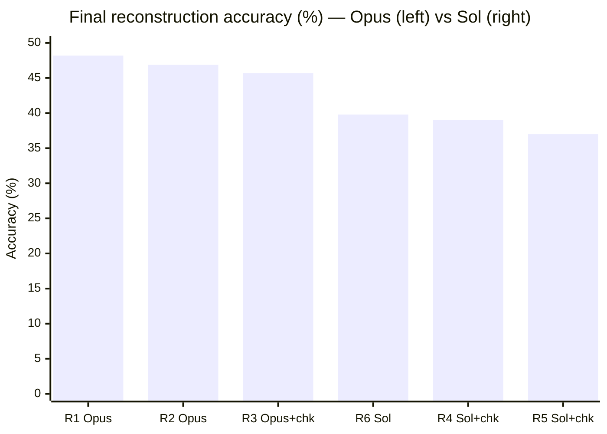
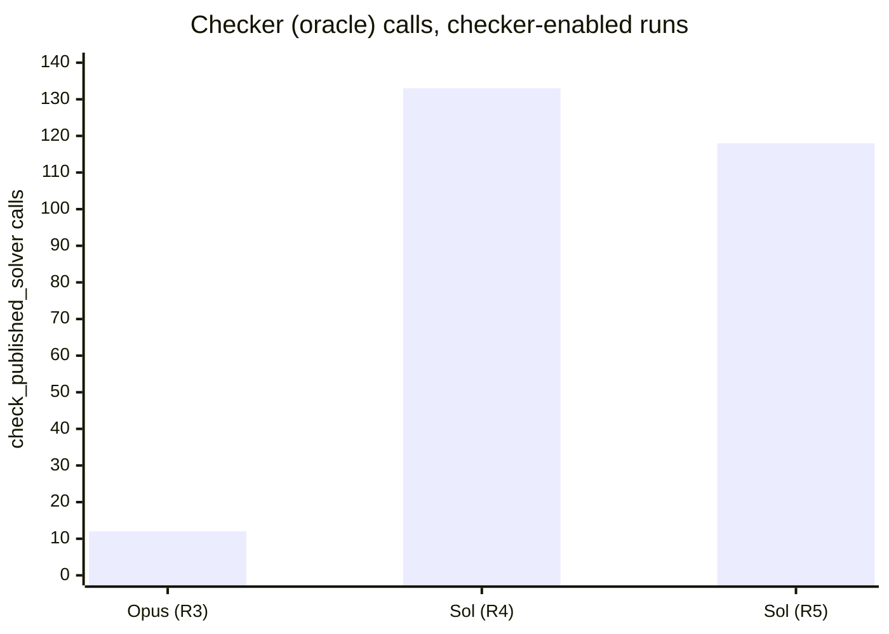

# Palimpsest

Palimpsest gives a team of frontier-model agents different private fragments of a word-substitution cipher and asks them to recover the original text. The agents work concurrently, share a Git repository and a chat channel, and decide for themselves how to solve. The runner preserves their tools, Git activity, responses, published solvers, and scores **without imposing a collaboration workflow** — no roles, no turns, no consensus, no automated repair.

This is a puzzle and an observational research artifact. It is not a hardened benchmark, but it could one day evolve into a useful eval.

## How it works

Take a public-domain book from Project Gutenberg and scramble it: every distinct word _type_ is replaced by another word type under a hidden bijection. Punctuation, capitalization, digits, and paragraph structure stay visible, so the text still _looks_ like English while its entire vocabulary has been reassigned. Recovering it is a distributed inference problem — frequencies, positions, collocations, and a lot of hypothesis testing.

Three agents each receive a **different private slice** of the evidence, released in ordered stages on a fixed clock (independent of what any agent is doing). They share:

- one **peer-visible Git origin** — the only thing that gets scored is code pushed to its `main` branch (`solver.py`);
- one **append-only team room** for discussion;
- ordinary tools (a shell, and in some runs an oracle "checker" that reports aggregate accuracy).

Partway through, a **hidden re-key** can silently change the substitution rule, breaking assumptions the agents have already committed to — a natural probe for belief revision.

```mermaid
flowchart LR
    A["config.yaml<br/><i>ExperimentManifest</i>"] --> B["Deterministic build<br/>(no provider access)"]
    B --> C["FixturePackage<br/>staged private evidence<br/>+ held-out oracle"]
    C --> D["3 concurrent agents"]
    D --> E["Shared Git origin<br/>+ team room + tools"]
    E --> F["Cutoff /<br/>sessions end"]
    F --> G["Freeze repos<br/>& workspaces"]
    G --> H["Evaluate pushed<br/>main:solver.py in sandbox"]
    H --> I["RunRecord +<br/>append-only trace.jsonl"]
    I --> J["Replay viewer /<br/>process grader"]
```



**What we're actually asking:**

1. How do models combine incomplete, differently distributed evidence?
2. When peer communication exists, what do they publish, reuse, ignore, or fight over?
3. How do they respond when a rule that used to work stops working?
4. Which failures come from the _model_, from _missing integration_, or from the _research infrastructure_?

Deterministic construction and scoring are reproducible; live model behavior is not. See `[docs/proposal.md](docs/proposal.md)` for the full framing and claim boundary.

## Findings

Six completed runs on Rafael Sabatini's _Fortune's Fool_ (Project Gutenberg [#65939](https://www.gutenberg.org/ebooks/65939), 18,129 words), 3 agents each, a hidden re-key at stage 4, a 90-minute cutoff, shared Git + team room. Two models faced off: **Claude Opus 5** and **GPT-5.6-Sol**. This is enough to see patterns clearly, but not to make statistical claims (n≈1–2 per condition, and the checker-on/off runs also differ in reasoning effort and spend ceiling, so treat those contrasts as descriptive).

### Opus recovered more of the text

Accuracy is the fraction of the 18,129 words recovered exactly. Every run produced a solver that ran end-to-end (coverage = 1.0); the models simply recovered different amounts.



| Run | Model  | Checker | Words recovered | Accuracy  |
| --- | ------ | ------- | --------------- | --------- |
| R1  | Opus 5 | off     | 8,734 / 18,129  | **48.2%** |
| R2  | Opus 5 | off     | 8,500 / 18,129  | **46.9%** |
| R3  | Opus 5 | on      | 8,279 / 18,129  | **45.7%** |
| R6  | Sol    | off     | 7,223 / 18,129  | **39.8%** |
| R4  | Sol    | on      | 7,077 / 18,129  | **39.0%** |
| R5  | Sol    | on      | 6,714 / 18,129  | **37.0%** |

The Opus band (45.7–48.2%) and the Sol band (37.0–39.8%) don't overlap.

### Agents love an oracle

When a checker was available, Sol teams hammered it — treating it as a search gradient rather than a spot-check — while the Opus team queried it a dozen times and moved on. More checking did not buy Sol more accuracy.



### More talk, more tools, lower scores

Across the board Sol runs were far busier than Opus runs — several times the tool calls, roughly **7×** the team-room messages, and 2–4× the input tokens — for _lower_ accuracy. Verbosity was not collaboration quality.

| Metric (per run)   | Opus 5 (R1–R3) | GPT-5.6-Sol (R4–R6) |
| ------------------ | -------------- | ------------------- |
| Team-room messages | 14–17          | 104–114             |
| Tool calls (total) | 169–182        | 519–914             |
| Input tokens       | 11.7M–17.4M    | 38.1M–57.9M         |
| Final accuracy     | 45.7–48.2%     | 37.0–39.8%          |

### Observations

1. **They genuinely collaborated.** Teams self-organized without being told to — someone gathered evidence, someone did linguistic analysis, someone integrated the solver — and they cited and corrected each other in the team room.
2. **The re-key tripped them up.** Agents noticed something broke, but fixated on the high-frequency words ("the", "of") and largely failed to fold in the sparse, low-frequency changes introduced at stage 4.
3. **They hallucinated sources.** Sol teams confidently mis-identified the book as _Captain Blood_, the _Forsyte Saga_, or _The Egoist_ on thin evidence, then built narratives around the wrong guess. Opus was more restrained. (The real source was _Fortune's Fool_.)
4. **They spammed the checker** — see above.
5. **They fought Git.** Rejected pushes, duplicate mappings, and stale commits winning out over better intermediate results were recurring failure modes; state management, not decoding, was often the bottleneck.
6. **They over-communicated.** More messages and tool calls correlated with _worse_ outcomes in these runs.
7. **Phrase-level yes, global no.** Agents clearly understood language locally — decoding plausible phrases and sentences — but struggled to leverage whole-narrative comprehension. The working method was hybrid linguistic-statistical inference, not deep reading.

### Grading

Outcome accuracy is only part of the picture. A separate grader reconstructs the _process_ — belief revision, collaboration, instrumental discipline — from the retained artifacts, scored on a 1–5 scale by **two independent reviewers from different provider families**, blinded to model identity and outcome. By design it emits **no composite score and no leaderboard**: every qualitative claim must cite retained evidence, and the outcome correlations in the reports are explicitly labeled observational, not causal. See `[docs/grading.md](docs/grading.md)`.

## Replay Viewer

Every terminal run can be replayed locally. The viewer binds to `127.0.0.1`, is strictly read-only, and never executes a solver on the host or mutates run artifacts.

The Palimpsest run replay viewer

Left, one synchronized lane per agent shows model responses and tool calls as they happened. Below them, the team room reveals messages as the playhead advances. Right, the decode pane reconstructs the team's published solver checkpoints and highlights each word as newly correct, previously correct, regressed, or changed-but-wrong, with a live accuracy readout. Along the bottom, a scrubbable timeline carries color-coded event ticks; press Space to play and step the speed from 1× to 300×.

```bash
pnpm puzzle:view --run-root artifacts/experiments/<experiment>/<run>
```

The decode pane reconstructs checkpoints inside the run's recorded Docker sandbox, so Docker must be running for it to populate; everything else replays without it.

## Install and run

**Prerequisites.** Use the toolchain pinned in `[.tool-versions](.tool-versions)` (Node 26.5.0, pnpm 10.14.0, Python 3.12.4, uv) and start Docker Engine or Docker Desktop — model-authored commands and solver scoring run in Linux containers.

```bash
pnpm install --frozen-lockfile
uv sync --frozen --project python
```

**Prepare fixtures** (deterministic, no provider access). `[experiments/config.yaml](experiments/config.yaml)` is the only authored experiment file — an `ExperimentManifest` that maps human-readable run IDs to their scientific inputs (source, team size, model, communication mode, release schedule, cutoff, spend ceiling, optional re-key and token limit).

```bash
pnpm puzzle:build --config experiments/config.yaml
```

**Validate** the manifest, package digests, sandbox, and provider-free smoke path. This never resolves credentials or opens a provider session.

```bash
pnpm puzzle:validate --config experiments/config.yaml
```

**Run an experiment.** This is the _only_ command that opens provider sessions and spends money; it requires explicit spend authorization and reads provider credentials from conventional environment variables (e.g. `OPENAI_API_KEY`). Runs execute sequentially; agents within a run execute concurrently.

```bash
pnpm puzzle:experiment --config experiments/config.yaml \
  --output artifacts/experiments/example --allow-spend true
```

**Inspect and re-evaluate** a completed run (no provider access). Each run writes an append-only `trace.jsonl` and atomically publishes a `run.json` `RunRecord`.

```bash
pnpm puzzle:evaluate --run-root artifacts/experiments/example/<run>   # re-score the pushed solver
pnpm puzzle:analyze  --run-root artifacts/experiments/example/<run>   # Git-overlap analysis
pnpm puzzle:view     --run-root artifacts/experiments/example/<run>   # open the replay viewer
```

The `puzzle:grade`, `puzzle:review`, `puzzle:report`, and `puzzle:calibrate` commands drive the process-grading pipeline described in `[docs/grading.md](docs/grading.md)`.

**Verify** the codebase (advisory development gates):

```bash
pnpm check    # versions, formatting, lint, types, viewer build
pnpm test     # fast unit + contract lanes
pnpm verify   # check + test
```

For the full operational contract — the slower `verify:full` lanes, exact pre-provider validation semantics, spend authorization, and the failure/freeze boundaries — see `[docs/architecture.md](docs/architecture.md)` and `[docs/roadmap.md](docs/roadmap.md)`. Generated packages and runs belong under the git-ignored `artifacts/` directory.

## Scope

Palimpsest deterministically constructs and scores word-substitution fixtures while preserving observable model behavior. It does **not** certify collaboration or belief revision, provide automatic causal analysis, exclude source recognition, or establish a general capability benchmark. Findings must stay scoped to the declared fixtures, treatments, models, and retained run records.

## Further reading

- [Proposal](docs/proposal.md) — the puzzle, research questions, treatments, and claim boundary.
- [Architecture](docs/architecture.md) — fixture, experiment, runtime, sandbox, record, and failure boundaries.
- [Roadmap](docs/roadmap.md) — the delivery sequence and definition of done.
- [Grading design](docs/grading.md) — the non-composite, evidence-linked process grader.
- [Experiment schema](experiments/schema.json) — the strict manifest contract.
- _[Riddle me this, clanker](https://failingloudly.substack.com/p/riddle-me-this-clanker)_ — the narrative write-up.
