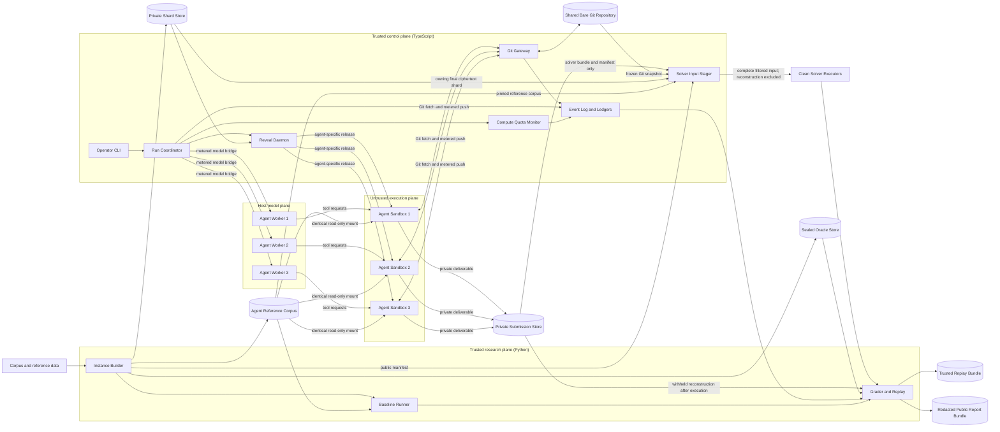

# Palimpsest Architecture

> **Status: Proposed - pre-Phase 0.** No implementation exists yet.

The [proposal](./proposal.md) defines Palimpsest's research intent, puzzle
mechanics, and success criteria. This document defines the target implementation
architecture. Where it makes an explicit implementation decision, this document
governs implementation mechanics.

In particular, this architecture deliberately refines three mechanisms described
in the proposal:

1. The live control plane is TypeScript/Node, while offline puzzle-domain and
   scientific workloads live in a separately versioned Python package.
2. Agents use ordinary authenticated Git rather than a canonical patch or message
   API.
3. The collaboration boundary meters the peer-visible surfaces enumerated by
   `GitAccountingFrameV1`. It does not rewrite agent-authored commits or claim
   that all timing, Git, and infrastructure channels have been eliminated.

The security claim is deliberately narrow: logical Git-state channels are
metered; timing, transport, and storage-representation channels are separately
bounded and red-teamed.

This architecture deliberately supersedes the proposal's canonical-message and
server-normalized-metadata mechanism. `proposal.md` remains unchanged and can be
reconciled separately; its broader puzzle mechanics and scientific gates still
apply.

Phase 0 remains a hard gate. The target architecture beyond the minimal
feasibility harness must not be hardened until channel separation, decipherment
headroom, revision dynamics, and communication value all pass.

## Contents

1. [Architectural drivers](#1-architectural-drivers)
2. [System context](#2-system-context)
3. [Runtime and language boundaries](#3-runtime-and-language-boundaries)
4. [Trust and visibility boundaries](#4-trust-and-visibility-boundaries)
5. [Instance generation and reveal](#5-instance-generation-and-reveal)
6. [Artifact and interface contracts](#6-artifact-and-interface-contracts)
7. [Direct Git collaboration channel](#7-direct-git-collaboration-channel)
8. [Asynchronous run lifecycle](#8-asynchronous-run-lifecycle)
9. [Event log, replay, and scoring](#9-event-log-replay-and-scoring)
10. [Failure semantics](#10-failure-semantics)
11. [Threat model](#11-threat-model)
12. [Delivery phases](#12-delivery-phases)
13. [Verification strategy](#13-verification-strategy)
14. [Traceability](#14-traceability)
15. [Residual risks and evolution](#15-residual-risks-and-evolution)

## 1. Architectural drivers

| Driver | Architectural consequence |
| --- | --- |
| Real asynchronous collaboration | Three agents run concurrently. There are no rounds, turns, assigned roles, or configured commit order. |
| Private, distributed evidence | Each agent receives one contiguous, chapter-aligned shard through a private mount. Unreleased chapters are absent from the mount. |
| Parallel progressive reveal | A trusted monotonic wall clock releases chapter batches to every shard on the same cadence, targeting equal cumulative shard fractions. |
| Git-native coordination | Agents use ordinary clone, fetch, pull, commit, branch, merge, and push workflows. Normal stale-push and merge-conflict behavior is preserved. |
| Information-limited communication | Every accepted, peer-visible Git ref operation and newly visible logical object is charged to the authenticated sender's cumulative budget. |
| No semantic policing of collaboration | Compressed evidence is permitted, but it is charged. Gate A must show that useful collaboration fits while the best measured lossless shard relay does not. |
| Strong isolation | Oracle data, other agents' shards, unreleased chapters, and private submissions never share an object store, mount, image layer, or ref namespace with the collaboration repository. |
| Reproducible artifacts | Generated instances, accepted Git history, ledgers, solver executions, and scores are versioned and hash-addressed. Agent behavior and operating-system scheduling remain stochastic. |
| Inspectable failure | Rejected pushes, stale work, duplication, conflicts, budget exhaustion, missed pulls, and incomplete submissions remain observable when they surface in Git, transport, sandbox telemetry, or submission artifacts. The control plane does not repair them. |
| Puzzle, not benchmark | Reconstruction is primary. Coordination, belief-revision, and calibration measures are diagnostics, not claims of isolated capability measurement. |

### 1.1 Non-goals

The initial architecture does not:

- reproduce agent decisions or concurrent scheduling from a seed;
- guarantee that all covert or infrastructure channels are closed;
- prevent role specialization or statistical pooling;
- resolve dictionary hypotheses or Git conflicts on behalf of agents;
- require submitted solvers to use Python;
- provide a multi-region service or public evaluation platform; or
- justify infrastructure work before the Phase 0 feasibility gates pass.

### 1.2 Fixed decisions, calibrated parameters, and empirical gates

Fixed architectural decisions are:

- TypeScript/Node for the live control plane;
- Python for corpus, cipher, baseline, grading, and analysis work;
- language-neutral schemas at the TypeScript/Python boundary;
- a server monotonic wall clock for reveal and deadline authority;
- direct authenticated Git for collaboration;
- logical Git-state accounting rather than packfile-size accounting;
- short fixed publication slots;
- accepted, peer-visible state as the communication charge;
- a hard push deadline followed by a read-only finalization window; and
- a single-host reference deployment with isolated processes and containers.

The byte cap, publication-slot duration, attempt and pull rate limits, reveal
points, stabilization interval, run duration, finalization duration, and compute
budgets are calibrated parameters. They are recorded in each run manifest and
must not be presented as architectural constants.

The four empirical gates remain:

1. **Channel separation:** a useful belief state fits below the strongest tested
   complete-shard encoding under the production Git accounting rules.
2. **Decipherment headroom:** strong mechanical baselines do not saturate the
   task, while capable solvers make progressive gains.
3. **Revision dynamics:** a competent solver can distinguish changed mappings
   from stable mappings under clock-driven reveal.
4. **Communication value:** an asynchronous, budgeted three-agent run differs
   meaningfully from its matched no-communication control.

## 2. System context



The Git Gateway is agent-facing but least-privileged. It controls both fetch and
receive policy, but it cannot read private shards, oracle data, or private
outputs, and it cannot control containers. The run coordinator may control
containers and private reveal mounts, but it cannot mutate the shared repository
or communication ledger directly. Python builder and grader jobs are
network-disabled and never agent-facing.

The Git Gateway, privileged Run Coordinator and container runtime, sealed Oracle
Store, each agent-private shard domain, and Private Submission Store use
distinct service accounts, mounts, and process boundaries. No one of these
domains has the union of Git, container-control, oracle, shard, and output
privileges.

## 3. Runtime and language boundaries

### 3.1 Component ownership

| Component | Runtime | Trust | Responsibilities |
| --- | --- | --- | --- |
| Instance Builder | Python | Trusted, sealed inputs | Corpus selection and preparation, stripping, normalization, tokenization, NER and entity regeneration, ciphering, regime generation, sharding, reveal-plan generation, and oracle artifacts. |
| Baseline Runner | Python | Trusted | Compression attacks, statistical ladder, source-identification attacks, oracle-segmentation variants, and Phase 0 evidence. |
| Operator CLI | TypeScript/Node | Trusted operator interface | Prepare, start, inspect, freeze, replay, and score runs through typed control-plane commands. |
| Run Coordinator | TypeScript/Node | Trusted, privileged | Lifecycle state, launch barrier, monotonic run epoch, deadlines, agent/container supervision, freeze, finalization, and infrastructure health. |
| Reveal Daemon | TypeScript/Node | Trusted | Atomic publication of precomputed chapter bundles into agent-specific private mounts. |
| Compute Quota Monitor | TypeScript/Node | Trusted | Model token and invocation budgets, wall time, CPU, memory, I/O, context policy, and subagent policy. |
| Git Gateway | TypeScript/Node | Trusted, least privilege | Git authentication, snapshot-gated fetch, receive policy, publication slots, logical-state accounting, budget admission, ref transactions, and Git audit events. |
| Agent Worker | Host model bridge plus isolated tools | Untrusted decisions | Model interaction, repository work, private shard analysis, and private deliverable production. |
| Agent Sandbox | OCI container | Untrusted execution | Local tools and solver development with restricted mounts and Git-only supported network access. |
| Solver Input Stager | TypeScript/Node | Trusted, narrow access | Builds a clean execution input from one solver bundle, one shard, the reference corpus, and the frozen Git snapshot; its service account cannot read reconstruction bytes. |
| Clean Solver Executor | OCI container | Untrusted execution | Re-executes a submitted solver without network or oracle access. |
| Grader and Replay | Python | Trusted, sealed inputs | Byte reproduction, reconstruction and dictionary scores, event-time metrics, artifact replay, and plots. |

The minimum Phase 0 baseline ladder is:

| Rung | Mechanical method |
| --- | --- |
| 1 | Frequency-rank assignment plus POS and syntactic-context typing. |
| 2 | Word n-gram pseudo-likelihood optimization with MCMC or simulated annealing. |
| 3 | Context-signature graph or distributional embedding alignment with constraint propagation. |
| 4 | Frozen contextual language-model scoring. |
| 5 | The strongest preceding decoder with oracle regime segmentation, isolating decipherment from switch detection. |

Target-identification and retrieval attacks are a separate mandatory baseline
track rather than another decoding rung.

### 3.2 TypeScript/Python contract

TypeScript never reimplements tokenization, cipher construction, regime
selection, metric formulas, or seeded generation. Python never owns live agent
scheduling, Git admission, or resource enforcement.

The boundary is coarse-grained:

1. TypeScript invokes a versioned Python command as a subprocess.
2. The request names immutable input artifacts and an empty output directory.
3. The Python process emits structured progress as NDJSON and writes large
   results as files.
4. A response manifest identifies every output by schema version, SHA-256
   digest, byte length, and producer version.
5. TypeScript validates the response manifest and treats domain payloads such as
   token IDs and oracle mappings as opaque.

Each subprocess receives a deadline and a fresh temporary output directory.
TypeScript promotes that directory atomically only after a zero exit, complete
and schema-valid NDJSON, an exact declared file set, matching byte lengths and
hashes, and an allowed producer version. Timeout, nonzero exit, malformed or
truncated progress, partial outputs, and manifest mismatch are hard failures;
they never produce success-shaped artifacts. A retry starts from the same
immutable request in a new directory and records the failed attempt.

There is no embedded Python interpreter or in-process FFI in the reference
architecture. This keeps failures isolated, avoids Node/Python lifecycle
coupling, and makes the exact process boundary replayable.

### 3.3 Target workspace

The intended repository shape is:

```text
apps/
  operator-cli/           # typed operator commands and root run surface
  control-plane/          # run lifecycle, reveal, quotas, freeze
  git-gateway/            # authenticated fetch/receive transport and metering
packages/
  control-domain/         # pure TypeScript state machines and policy
  contracts/              # JSON Schemas, generated bindings, golden fixtures
  git-meter/              # accounting-frame and visibility algorithms
python/
  pyproject.toml
  src/palimpsest/
    corpus/
    generation/
    compression/
    baselines/
    grading/
    replay/
agent/
  sdk/                    # optional, oracle-free helpers
  scaffold/               # initial repository and solver contract
infra/
  containers/
tests/
  integration/
docs/
```

pnpm workspaces manage TypeScript packages with `pnpm-lock.yaml`; uv manages the
Python project with an independent `uv.lock`. Node, Python, pnpm, uv, Git, base
images, offline model weights, and reference-corpus versions are pinned. The
single operator-facing root command, `pnpm verify`, invokes both ecosystems
without merging their dependency graphs.

The optional agent SDK contains only public schemas, dictionary helpers, and
solver-entrypoint utilities. Trusted generation, baseline, and grading modules
are never installed in an agent image.

## 4. Trust and visibility boundaries

| Artifact or capability | Owning agent | Non-owning agent | Run control | Git Gateway | Builder/grader |
| --- | --- | --- | --- | --- | --- |
| Public instance manifest | Read | Read | Read | Read policy subset | Read/write |
| Deduplicated agent reference corpus | Read-only | Read-only | Mount/hash only | Denied | Build/read |
| A given agent's released chapters | Read | Denied | Mount/release | Denied | Read |
| A given agent's unreleased chapters | Denied | Denied | Release-only access | Denied | Read |
| Shared Git refs and objects | Read/write through Git policy | Read/write through Git policy | Read frozen snapshot only | Authoritative write boundary | Read for grading |
| Exact receive and resource telemetry | Denied during run | Denied during run | Write/read own events | Write/read channel events | Read after sealing |
| Master seed and oracle manifest | Denied | Denied | Denied | Denied | Read/write |
| A given agent's private submission | Write/read | Denied | Seal/hash only | Denied | Read after sealing |
| Container runtime socket | Denied | Denied | Allowed | Denied | Denied |
| External model/network access | Host worker only | Host worker only | Mediated and metered | Git transport only | Disabled for jobs |

The model bridge runs on the host side of the agent boundary. It accounts for
model input/output tokens and invocations, while tool code executes in the
network-restricted sandbox. Submitted solver code never executes inside the
grader or control-plane process.

Agent images are built independently from builder and grader images. Oracle
files, target-selection source corpora, private model caches, and secret-bearing
build layers must not be present even if their paths are not mounted. The
separately packaged agent reference corpus is the only corpus mounted into agent
and clean-solver environments.

## 5. Instance generation and reveal

### 5.1 Generation pipeline

The Python Instance Builder performs:

1. Select a source through a corpus adapter for Gutenberg, recently digitized
   public-domain text, or private text.
2. Strip source boilerplate and parse chapter boundaries.
3. Deduplicate against the reference corpus using MinHash/LSH and structural
   fingerprints.
4. Freeze a deduplicated agent reference-corpus bundle that excludes the target,
   alternate editions, anthologies containing it, and structural duplicates.
5. Normalize and tokenize using a versioned, single-source implementation.
6. Detect named entities and replace proper nouns consistently with
   seed-generated names.
7. Freeze the regenerated prepared plaintext as the grading ground truth.
8. Build the vocabulary and a seeded derangement with no identity mappings,
   using unrestricted or POS-preserving permutation according to the profile.
9. Generate partial rotations at eligible chapter boundaries.
10. Cipher the text while preserving punctuation, capitalization patterns,
   digits, paragraphs, and chapter structure.
11. Produce three approximately equal, contiguous, chapter-aligned shards.
12. Choose full-run placement with at least one switch near a shard boundary and
    one switch inside a shard.
13. Produce immutable public, reference-corpus, private-shard, reveal, and oracle
    artifacts.

For every switch, adjacent segments satisfy the configured minimum length
(nominally at least 10,000 tokens), and changed types must occur at least `k`
times in both segments, be stratified across frequency bands, target the
configured token mass, and have matched unchanged controls. Rotation composes
the prior key with a derangement over selected images, preserving bijection. A
changed entry must differ from both its plaintext identity and its previous
ciphertext mapping.

The oracle names directions explicitly:

- `encryption_key`: plaintext type -> ciphertext type;
- `recovered_mapping`: ciphertext type -> plaintext type.

### 5.2 Seeds and artifact determinism

The master seed is secret. The builder derives domain-separated sub-seeds for
corpus selection, entity replacement, the initial key, each switch, matched
controls, sharding, and reveal planning. Seeds are encoded as hexadecimal
strings, never JavaScript numbers.

A seed is provenance, not the whole replay truth. NER models, tokenizers, native
libraries, weights, corpus snapshots, and hardware-sensitive computation may
change results. The prepared plaintext and every generated artifact are
therefore frozen with producer versions and hashes.

Public manifests must not expose the master seed, prepared-plaintext hash, raw
source hash, keys, switch truth, entity mapping, or other identifiers that can
act as source-recognition oracles.

### 5.3 Reveal schedule

The reveal clock is monotonic elapsed wall time from the common launch barrier.
Token consumption is a resource measure, not a reveal clock.

The builder precomputes chapter-aligned release batches. At each reveal point,
the schedule targets the same cumulative fraction of each shard's ciphertext
token mass. Chapters remain atomic, so equal fractions are a target rather than
a claim of semantically equal evidence. The manifest records achieved fractions
and deviations.

The reveal daemon:

- publishes each chapter exactly once and atomically;
- keeps future chapter files physically absent from agent mounts;
- records scheduled and actual monotonic release times;
- assigns a total server event sequence to break timestamp ties;
- guarantees monotonic availability;
- releases every chapter before the push deadline; and
- preserves a configured stabilization interval between the last release and
  the push deadline.

Detection latency starts at the actual recorded reveal event where the oracle's
contradictory-token threshold is crossed, not the nominal scheduled time.

## 6. Artifact and interface contracts

JSON Schema is the language-neutral contract authority. TypeScript and Python
bindings are derived or validated from the same schemas and golden fixtures.
Every contract carries an integer `schemaVersion`.

| Contract | Producer | Visibility | Purpose |
| --- | --- | --- | --- |
| `InstanceBuildRequest` | Operator/control plane | Trusted | Corpus selector, seed, transform versions, difficulty settings, and generation profile. |
| `PublicInstanceManifest` | Instance Builder | Agent-visible | Safe instance ID, tokenizer/vocabulary metadata, scaffold hash, public configuration, and public artifact references. |
| `AgentReferenceCorpusManifest` | Instance Builder | Agent-visible | Deduplicated read-only reference snapshot, content hashes, preprocessing version, and exclusion audit digest. |
| `OracleManifest` | Instance Builder | Sealed | Prepared plaintext, token alignment, entity map, regime keys, switches, changed/control sets, and contradiction thresholds. |
| `ShardManifest` | Instance Builder | Trusted only | Complete ordered chapter bundles, chapter/token ranges, ciphertext counts, reveal IDs, future artifact hashes, and owner binding. |
| `ReleasedShardManifest` | Reveal Daemon | Owning agent and Solver Input Stager | Monotone projection containing only released chapter metadata and hashes; its final version binds the complete agent-visible shard. |
| `RevealSchedule` | Instance Builder | Control plane; sanitized events become visible | Monotonic offsets, per-agent chapter bundles, achieved fractions, and stabilization boundary. |
| `DifficultyConfig` | Operator/Instance Builder | Public fields plus sealed hidden parameters | All puzzle dials, switch/eligibility settings, and visibility policy. |
| `ScoringPolicy` | Grader configuration | Public formulas plus sealed oracle thresholds | Metric versions, event matching, penalties, thresholds, and malformed/missing artifact behavior. |
| `RunManifest` | Control plane | Public policy plus private operational fields | Images, models, scaffold, clock policy, quotas, Git policy, `GitGenesis`, budgets, slots, and deadlines. |
| `GitAccountingFrameV1` | Git Gateway | Trusted ledger; digest may be reported | Prefix-free representation of one accepted peer-visible Git transaction. |
| `PushLedgerEntry` | Git Gateway | Trusted during run | Authenticated agent, slot, frame digest/size, budget before/after, ref outcome, and event sequence. |
| `PublishedSnapshot` | Git Gateway | Agent-visible through Git; manifest trusted | Publication slot, immutable advertised ref map, visibility-journal digest, predecessor, and authoritative event sequence. |
| `RunEvent` | Trusted components | Trusted during run | Hash-chained, idempotent lifecycle, reveal, Git, quota, freeze, submission, and infrastructure event envelope. |
| `FreezeSnapshot` | Run Coordinator | All agents receive public portion | Final advertised ref map, Git bundle hash, visibility-journal digest, ledger digest, final event sequence, and event-chain head. |
| `PrivateDeliverableManifest` | Agent | Private submission store and grader | Freeze ID, final `ReleasedShardManifest` hash, solver command/bundle, reconstruction path, and output hashes. |
| `TrustedReplayBundle` | Control plane/grader | Sealed | Oracle-bearing inputs needed to verify Git history, ledgers, solver reproduction, and scores. |
| `ScoreReport` | Grader | Report artifact | Primary scores, diagnostics, trajectories, versions, and all input digests. |
| `PublicReportBundle` | Grader/exporter | Redacted public artifact | Approved scores, plots, sanitized trace, and non-identifying provenance. |

The complete `ShardManifest` and future chapter hashes are never mounted into an
agent sandbox. Each reveal emits a new `ReleasedShardManifest` containing only
chapter artifacts already available to that agent. After the final reveal, its
final hash is the shard binding used by solver submission and clean execution.

Cross-language JSON uses RFC 8785 JSON Canonicalization Scheme bytes after schema
validation. Seeds and integers outside the interoperable JSON number range are
schema-defined decimal or hexadecimal strings; NaN and Infinity are forbidden.
NDJSON logs contain one canonical JSON object followed by LF per record.
Multi-file artifacts use an uncompressed POSIX ustar stream with lexicographically
sorted paths, UID/GID and mtime zero, empty owner/group names, normalized modes,
and rejected overlong paths. SHA-256 identifies artifacts independently of the
repository's Git object format. The exact JSON and archive bytes are golden
fixtures. Contract changes require a new version or an explicit migration;
replay never silently interprets an old artifact under new semantics.

### 6.1 Difficulty and scoring configuration

`DifficultyConfig` records every proposal dial rather than scattering parameters
across services:

| Field group | Required settings |
| --- | --- |
| Text geometry | Text length, shard count, agent count, and chapter-alignment policy. |
| Substitution | Function/content scope and unrestricted versus POS-preserving permutation. |
| Regime changes | Switch count `S`, minimum segment length, active threshold `k`, rotation fraction, changed token mass, and matched-control policy. |
| Reveal | Reveal points, chapter granularity, equal-fraction tolerance, and stabilization interval. |
| Communication | Per-agent byte budget, publication-slot duration, ref limits, and attempt/pull limits. |
| Compute | Run duration plus per-agent model-token, invocation, CPU, memory, and wall limits. |
| Reference data | Agent reference-corpus snapshot and configured size. |
| Oracle visibility | Hidden versus revealed boundaries and switch-submission mode. |
| Calibration | Optional confidence/Brier scoring and confidence field policy. |

Every run freezes calibrated defaults in its manifests. Hidden values live only
in trusted configuration; the public projection contains only parameters agents
are meant to know.

`ScoringPolicy` versions the IDF smoothing and cap, entity-assignment algorithm,
switch-event matching window, premature-alarm penalty, adaptation threshold,
confidence scoring, aggregation, and treatment of missing or malformed
hypothesis artifacts. The v1 switch policy publishes `S` and requires exactly
`S` switch predictions; a malformed or wrong-count switch artifact receives zero
switch-detection credit without invalidating reconstruction scoring. A future
hidden-`S` profile requires a new public policy identifier and fresh calibration.

### 6.2 Shared hypothesis artifacts

To support diagnostic scoring without constraining other collaboration, the
shared repository reserves machine-readable paths for:

- per-hypothesized-regime recovered mappings;
- mapping provenance;
- switch hypotheses; and
- the solver entrypoint manifest.

An agent-authored mapping record contains at least the ciphertext type, proposed
plaintext type, hypothesized regime or position range, supporting chapter
range, local occurrence count, and confidence. The grader attaches the
validating agent and validation time from trusted publication events; authored
identity and timestamp fields are ordinary metered content, not scoring
authority.

Agents may keep arbitrary additional code and notes within the allowed
repository policy. The server does not choose a winning hypothesis or require a
particular solver design.

`main` is the authoritative team-hypothesis scoring ref. Each agent namespace
has one reserved `refs/heads/agents/<agent-id>/hypothesis` ref for per-agent
diagnostics; other branches are collaboration artifacts and are not scored as
hypotheses. Mapping sets, provenance, switch hypotheses, and solver entrypoints
have versioned JSON Schemas. If a keyed mapping appears more than once in one
scoring ref, the artifact is malformed rather than resolved by file or commit
order.

For a current keyed record, attribution uses the first accepted transaction on
that scoring ref whose published tip exposes those exact canonical record bytes
after the key was absent or held different bytes. Its authenticated sender is
the validating agent and its `PublishedSnapshot` boundary is the validation
time. Later fast-forwards or merges that preserve the bytes preserve that
attribution. Replacement bytes receive a new attribution; deletion removes the
record, and a later re-addition starts again. If more than one accepted
transaction in one slot contributes to the eventual scoring-ref lineage, the
private admission sequence breaks the attribution tie, but every contribution
in that slot retains the same public validation time. This order is diagnostic
only and does not create intermediate scoring states.

### 6.3 Solver contract

Submitted solvers may use any executable language available in the declared
offline runtime. A private deliverable contains:

- the reconstruction;
- a solver bundle and data;
- a manifest containing an argv array with no shell interpolation;
- the exact `FreezeSnapshot` ID and final `ReleasedShardManifest` hash; and
- hashes of every submitted file.

At sealing, the Private Submission Store places solver inputs and reconstruction
bytes behind separate access policies. The Solver Input Stager can read the
manifest and solver bundle but not the reconstruction object.

The Stager treats every bundle as hostile. Bundles use the canonical
uncompressed archive profile from this section and may contain only bounded
regular files and directories with normalized relative paths and regular or
executable modes. It rejects absolute or parent paths, NULs, duplicate paths,
Unicode- or case-collisions, symlinks, hardlinks, sparse files, devices, FIFOs,
sockets, overlong names, undeclared files, and entry or byte-limit violations.
Extraction occurs in a fresh no-follow root; every extracted file is rehashed
against the manifest before execution. The argv executable must resolve inside
the verified bundle or to an explicitly pinned offline runtime, and no shell
interpolation is introduced.

The clean executor mounts the Solver Input Stager's filtered solver bundle, the
agent's complete ciphertext shard, the exact frozen Git snapshot, the pinned
agent reference corpus, the public manifest, and an empty output directory. It
has no network, Git credentials, oracle data, submitted reconstruction, or
grader secrets. The executor writes one canonical reconstruction file. The
grader compares it byte-for-byte with the withheld private reconstruction
before computing quality metrics.

Hand-derived dictionary data is permitted in the solver bundle. Static and
dynamic red-team checks address degenerate output-copying strategies; the
reproduction check by itself is not claimed to prove semantic solving.

The submitted private solver bundle is an explicit execution input alongside
the trusted shard, frozen repository, reference corpus, and public manifest. It
is unbudgeted because it is never visible to peers; the communication budget
constrains collaboration, not an agent's private handoff to the grader. This
makes precise the proposal's "submitted solver" language while preserving the
requirement that the reconstruction itself is withheld during clean execution.

## 7. Direct Git collaboration channel

### 7.1 Agent-facing Git model

Agents use an ordinary Git remote. The reference deployment uses a per-agent SSH
credential with a forced command that routes both `git-upload-pack` and
`git-receive-pack` through the TypeScript Git Gateway. There is no shell or
repository filesystem access.

The advertised writable refs are:

- `refs/heads/main`, writable by every agent through fast-forward updates; and
- `refs/heads/agents/<agent-id>/*`, writable only by that authenticated agent.

All agents may fetch every advertised accepted ref. Ordinary commits and merge
commits are allowed. Updates must be fast-forward. Force updates, ref deletion,
tags, notes, replace refs, hidden secret refs, signed-push certificates, push
options, and writes to another agent's namespace are rejected.

Agent branch suffixes must pass `git check-ref-format`, use a bounded ASCII
grammar, and stay within the configured length and count limits. The raw
accepted ref-name bytes remain part of the communication charge.

`GitAccountingFrameV1` accepts exactly one ref update per push. Branches and
merge commits remain ordinary Git objects, but multi-ref pushes are rejected.
This removes ambiguous partial-update and protocol-capability behavior from the
first accounting version.

The repository permits regular and executable files. It rejects symlinks,
Gitlinks/submodules, `.gitmodules`, LFS, alternates, unsafe attributes or hooks,
case-colliding paths, absolute paths, `..`, and invalid or non-normalized paths.
Object count, object size, tree depth, delta depth, ingress bytes, and receive
duration have independent denial-of-service ceilings. These ingress ceilings
are not the communication budget.

Authentication, not commit author or committer metadata, identifies the agent
whose budget is charged.

The v1 collaboration repository uses Git's SHA-256 object format. Changing the
object format changes OID width, accounting bytes, fixtures, and compressor
results; it therefore requires a new accounting version and a fresh Gate A
calibration.

### 7.2 Receive and publication lifecycle

The Git Gateway wraps both sides of Git's smart protocol. Git places incoming
objects in quarantine and invokes receive checks before updating refs; rejected
quarantined objects are discarded. See the official
[`git-receive-pack`](https://git-scm.com/docs/git-receive-pack) and
[hooks](https://git-scm.com/docs/githooks) documentation.

A standalone `pre-receive` hook is not the transaction authority: successful
hook completion does not guarantee that the ref update will later succeed, and
a hook cannot atomically commit an external budget ledger with Git refs. The
forced-command wrapper owns the `git-receive-pack` child, hook IPC, repository
lease, reservation journal, native reference-transaction outcome, and final
client response.

A `PublishedSnapshot` is an immutable manifest plus a read-only object directory
containing exactly its advertised ref closure. The Gateway holds one atomic
current-snapshot pointer. At the start of each fetch or receive connection it
captures one snapshot ID and maps that manifest back to ordinary
`refs/heads/*`; the connection keeps that same ref map and allowed-OID set for
its lifetime.

`git-upload-pack` reads only the captured snapshot's object directory. It neither
acknowledges a `have` nor serves a `want` outside that snapshot's allowed set.
Each receive runs in a slot-private staging object directory with separate
internal refs; dependency resolution may use only its captured snapshot or its
own quarantine. It cannot resolve thin-pack bases, tree edges, or guessed OIDs
against another pending receive or an unpublished slot object. Internal refs and
objects are never advertised. This physical separation, in addition to disabled
fetch-by-unadvertised-OID, prevents object-existence probes against a shared
mutable database.

Agents still see one standard bare remote. Snapshot manifests, staging refs,
object directories, and the current-snapshot pointer are private Gateway
implementation state, not agent-facing repositories or APIs.

For each incoming push:

1. Authenticate the run and agent from the transport.
2. Apply attempt-rate, ingress-resource, and deadline checks.
3. Receive the complete pack into durable quarantine.
4. Reject a second pending receive for the same agent or a receive exceeding
   global queue, process, disk, byte, or wait-time bounds.
5. Assign a private arrival sequence and the next eligible publication slot.
6. Hold the native response while the completed receive waits for that slot.

Once step 5 completes, processing is independent of client connection state. A
disconnect loses only the response; it cannot cancel an admitted transaction.
The accepted ref, event, and ledger are authoritative, and an agent resolves an
unknown outcome with ordinary fetch/status inspection before retrying.

At a slot boundary, the Gateway:

1. Stops new receive advertisement and takes the repository publication lease.
2. Freezes the slot-start `PublishedSnapshot`, budget ledgers, and ever-visible
   object set.
3. Persists a `SLOT_BUILDING` record with the slot-start snapshot, candidate
   arrival sequences, and prior ledger/journal digests.
4. Processes queued receives in private arrival order.
5. Revalidates the requested ref's expected old OID against the evolving
   internal ref map. A same-ref contender that became stale is rejected.
6. Validates namespace, fast-forward, object connectivity, object type, mode,
   path, and feature policy. Every dependency must be present in that receive's
   quarantine or its captured snapshot-visible set.
7. Rejects any quarantined object not reachable from the proposed accepted tip.
8. Computes each candidate's accounting frame against the **slot-start**
   ever-visible set. If two agents independently expose the same new object in
   one slot, each pays for that object; infrastructure order does not transfer
   budget credit between agents.
9. Checks `remaining = limit - committed - reserved`, then writes a durable
   `RESERVED` push reservation with the old/new ref, frame digest, and charge.
10. Allows the native single-ref transaction only while a matching Gateway
   lease and reservation token are live. A `reference-transaction` hook reports
   `committed` or `aborted` back to the wrapper.
11. On native success, marks the reservation `FINALIZED` and commits the ledger
    debit and accepted event. On native failure, marks it `ABORTED` and charges
    nothing.
12. After all candidates resolve, unions their accepted objects into the next
    visibility journal, then persists `SLOT_PUBLISHING` with the accepted
    sequence set, accounting-frame digests, next ref map, and next
    ledger/journal digests before building a new immutable public object
    directory.
13. Atomically swaps the current-snapshot pointer, marks the slot
    `SLOT_PUBLISHED`, releases the publication lease, reopens Git
    advertisements, and returns fixed-format native results to connected
    clients.

No fetch or new receive advertisement can observe an intermediate slot state.
Connections pinned to an older immutable snapshot may finish while publication
builds the next one; they cannot observe its staging directories.
The Gateway serializes only admission and publication by server arrival order;
this is repository consistency, not a scheduled agent turn or predetermined
commit order. Competing same-ref pushes still race, while valid independent-ref
updates can coexist in the same published snapshot. The Gateway never rebases,
merges, or last-writes a stale push.

The final slot has a hard drain deadline. Validation or publication overrun is
an infrastructure failure, not an implicit extension. Slot duration and queue
bounds must be benchmarked against worst-case allowed validation and accounting
work before calibration runs.

### 7.3 Git accounting frame

`GitAccountingFrameV1` is a deterministic, injective, length-delimited binary
serialization. Multi-byte integers are fixed-width unsigned big-endian values.
The v1 grammar is:

| Field | Encoding |
| --- | --- |
| Magic | Eight ASCII bytes `PLMPGIT1`. |
| Frame length | `u64`, including the complete header and body. |
| Accounting version | `u16`, value `1`. |
| Object format | `u16`, value `1` for Git SHA-256. |
| Authenticated agent | Fixed `u16` run-local agent number. |
| Publication slot | `u32`. |
| Ref operation | `u8` operation (`1` create, `2` update), `u16` ref-name length, raw ref-name bytes, then 32-byte old and new OIDs. A create uses an all-zero old OID. |
| Object count | `u32`. |
| Object records | For each object: 32-byte OID, `u8` type (`1` commit, `2` tree, `3` blob), `u64` content length, then exact raw Git object content bytes. |

Object records are sorted by unsigned raw OID bytes. Duplicate OIDs are
forbidden. The explicit type and length fields plus raw content are equivalent
to Git's logical `<type> <length> NUL <content>` preimage and uniquely determine
the object. They contain every object reachable from the accepted new tip that
is absent from the slot-start ever-visible set. The frame header and ref record
are the fixed accepted-push overhead. Fixed-width agent and slot fields ensure
that agent names and later slots do not change framing cost.

`RunManifest.GitGenesis` fixes the accounting version, Git object format,
initial `PublishedSnapshot` ref map, sorted initial ever-visible OID set, and
SHA-256 digest of their canonical encoding. Ref count, ref-name length, live-ref
count, object count, object size, and total frame length are bounded by the run
policy before encoding.

The cumulative communication charge is the serialized frame length. The
aggregate charge is diagnostic; the per-agent cumulative ledger is operative.

Logical object bytes include commit messages, authors, emails, author and
committer timestamps, signatures, parent order, tree edges, filenames, file
modes, and blob contents. Agents may deliberately commit a compressed shard or
encode evidence in metadata, names, graph topology, or object-ID selection, but
those bytes and references are charged.

The meter does not use inbound or outbound packfile size. Git pack order, delta
selection, zlib choices, thin-pack choices, and client version must not alter the
charge for the same logical ref/object transaction.

The encoder, decoder, and re-encoder must agree on published golden binary
vectors before Gate A. Decode followed by encode must be byte-identical, and
mutating any peer-visible field must mutate the frame or be rejected.

### 7.4 Visibility journal and object-store policy

The Git Gateway maintains an append-only set of objects that have ever been
peer-visible. It does not use current reachability alone: deleting a ref would
not erase information already fetched by another agent. Ref deletion is
prohibited, but the ever-visible journal remains the accounting authority.

The initial shared repository objects are declared common side information. If
a ref exposes an existing but never-visible object, the frame charges that
object's logical contents. Choosing among already visible objects is charged by
the new commit/tree/ref bytes containing the choice.

Incoming unreachable objects are rejected rather than stored. The collaboration
repository has:

- no alternates or shared object store;
- no oracle, shard, output, or hidden secret refs;
- no LFS or dumb HTTP;
- no filesystem access from agents;
- no fetch of unadvertised object IDs; and
- server-private or disabled reflogs during the run.

The Gateway normalizes each supported fetch request to
`(PublishedSnapshot ID, sorted advertised want set, sorted snapshot-visible have
set, pinned protocol/capability profile)`. Unsupported capabilities are filtered
or rejected. For that tuple, it regenerates the pack in canonical unsigned-OID
order with one worker, fixed compression settings, no bitmaps, no delta
heuristics, and no reuse of sender-provided compressed objects or deltas.
Clients with different legitimate local histories may receive different
incremental packs; identical normalized tuples must produce identical bytes.
Golden vectors vary inbound push encoding while holding this tuple fixed. If the
pinned Git implementation cannot satisfy that test, transport representation is
reclassified as a measured residual channel and included in Gate A rather than
claimed away.

### 7.5 Publication timing

Accepted refs become visible only on short fixed wall-clock publication slots.
This preserves asynchronous work while removing sub-slot timing precision from
the peer-visible channel. Pulls are rate-limited so polling cannot recover exact
arrival time or destabilize other agents.

Publication slots do not eliminate timing information. An agent can still
communicate through the presence or absence of a push in a slot or by choosing a
later slot. Gate A and Phase 5 must bound this capacity using the configured run
duration, slot count, ref policy, and rate limits. The architecture makes no
claim that the byte ledger alone is a complete information-theoretic bound.

Rejected payloads are not charged because peers cannot fetch them. Attempts are
rate-limited and subject to raw ingress ceilings; rejection details and exact
times remain private. Public errors use fixed codes to suppress variable
diagnostic bandwidth. Success, failure, and the presence or absence of a later
published ref still carry bounded state and timing information included in the
channel analysis.

### 7.6 Crash consistency

The ledger uses a single-writer transactional store in the reference deployment.
Every receive reservation has one of `RESERVED`, `FINALIZED`, or `ABORTED`
status. A `RESERVED` charge is hard and reduces available budget even though it
is not yet reported as communication consumed.

The Gateway never starts transaction N+1 until transaction N's native ref
outcome and reservation state are durable. After a crash, a global recovery
barrier denies fetch, receive, slot processing, and later ref updates until
every `RESERVED` record and nonterminal slot record is resolved. Reservation
recovery compares the transaction marker, old/new OIDs, native
`reference-transaction` outcome, and internal ref state:

- if the accepted internal ref transition exists, it finalizes the debit and
  accepted event into the slot record;
- if refs remain at the old values, it aborts the reservation without charge;
- if neither state can be proven, it freezes and invalidates the run.

Each slot record has one of `SLOT_BUILDING`, `SLOT_PUBLISHING`,
`SLOT_PUBLISHED`, or `SLOT_ABORTED`. Recovery resumes a durable
`SLOT_BUILDING` batch from its quarantines and private arrival order. Once any
reservation is `FINALIZED`, the batch cannot be abandoned: recovery must derive
the visibility-journal union and immutable snapshot from its accepted event set,
persist `SLOT_PUBLISHING`, and complete the current-snapshot pointer swap. A
`SLOT_BUILDING` batch may become `SLOT_ABORTED` only if no native ref transition
was accepted. A recovered `SLOT_PUBLISHED` record must match the current pointer
and all recorded digests. If deterministic completion or verification is
impossible, the run becomes `INVALID` before any Git service reopens.

During a transaction, `committed + reserved` may exceed committed charges but
must never exceed the limit. At every completed publication boundary and after
recovery, the cumulative ledger equals the sum of accepted accounting frames,
the visibility journal matches the published snapshot, and no reservation
remains unresolved. A Git, event-log, visibility-journal, or ledger mismatch is
an infrastructure integrity failure, not an agent outcome.

## 8. Asynchronous run lifecycle

```mermaid
sequenceDiagram
    participant B as Instance Builder
    participant C as Run Coordinator
    participant R as Reveal Daemon
    participant A as Three Concurrent Agents
    participant G as Git Gateway
    participant S as Shared Bare Git Repository
    participant O as Private Submission Store
    participant T as Solver Input Stager
    participant E as Clean Solver Executors
    participant D as Grader and Replay

    B->>C: Public bundle, reference corpus, private shards, sealed oracle reference
    C->>A: Start barrier and identical run epoch
    par Reveal clock
        loop Each precomputed reveal milestone
            R-->>A: Chapter-aligned equal-fraction reveal events
        end
        R-->>A: All shards released before stabilization boundary
        Note over R,A: Reveal complete; agent work continues to push deadline
    and Independent agent work
        loop Until push deadline
            A->>A: Compute privately
            opt Agent chooses to fetch or pull
                A->>G: Native Git fetch
                G->>S: Read immutable published snapshot
                G-->>A: Canonical server fetch pack
            end
            opt Agent chooses to push
                A->>G: Native Git push
                G->>G: Receive into quarantine and queue
            end
        end
    and Fixed Git publication clock
        loop Each publication slot until push deadline
            G->>G: Validate, meter, reserve, and transact
            G->>S: Publish one atomic slot snapshot
            G-->>A: Native success or fixed-code rejection
        end
    end
    C->>G: Close push admission at fixed deadline
    G->>S: Drain final slot and seal advertised refs
    C-->>A: Frozen ref map; Git becomes read-only
    A->>G: Optional final pull
    G->>S: Read frozen snapshot
    G-->>A: Frozen fetch pack
    A->>O: Private solver bundle and reconstruction
    C->>O: Seal outputs at finalization deadline
    O->>T: Solver bundle and manifest only
    S->>T: Exact frozen Git bundle
    B->>T: Final shard, reference corpus, and public manifest
    T->>E: Complete filtered execution input; reconstruction withheld
    E->>D: Reproduced outputs
    O->>D: Withheld reconstruction after solver exit
    B->>D: Sealed oracle
    D->>D: Verify replay, byte equality, and scores
```

### 8.1 Lifecycle states

Instance building precedes the run lifecycle. A generation failure produces no
`PREPARED` run.

| State | Responsibilities and transition |
| --- | --- |
| `PREPARED` | Python artifacts exist and schemas, hashes, images, models, Git policy, quota policy, mounts, and matched-run configuration have passed preflight. |
| `STARTING` | Launch agents behind a common barrier; request Git Gateway repository initialization; initialize the event store, ledgers, and private mounts. |
| `RUNNING` | Establish the monotonic epoch. Reveal chapters, run agents concurrently, meter Git, and enforce compute quotas; complete reveal before the configured stabilization interval. |
| `PUSH_CLOSED` | At the fixed deadline, reject new receive streams. A request is admitted only if its complete pack arrived before cutoff and received an arrival sequence. |
| `DRAINING` | Process only admitted requests in the final publication slot, then establish one consistent ref/ledger/event boundary. |
| `FROZEN` | Seal the advertised ref map, Git bundle, visibility journal, ledger, and event sequence. Git is pull-only. |
| `FINALIZING` | Agents may pull the frozen refs and produce private deliverables under their remaining compute budgets. |
| `SUBMITTED` | Hash and close private output mounts, terminate agents, and seal resource telemetry. |
| `REPLAYED` | Verify accepted Git transactions, accounting frames, ledgers, artifacts, and clean solver executions. |
| `SCORED` | Seal deterministic score and diagnostic reports. |
| `INVALID` | Infrastructure or integrity failure prevents a valid experiment. Agent mistakes do not use this state. |

Silence never ends a run. Push closure and freeze occur at their configured
monotonic boundaries, with only the bounded drain between them; neither is
inferred from quiescence.

### 8.2 Compute fairness

Each agent receives predeclared limits for:

- model input and output tokens;
- model invocation count;
- monotonic wall time;
- CPU time and CPU allocation;
- memory peak and limit;
- disk and I/O;
- context truncation;
- file-read policy; and
- subagent policy.

Trusted gateways and container controls measure these limits; agents do not
self-report them. The same limits remain active through finalization. Output
bytes are unbudgeted, but post-freeze reasoning and execution are not free.

Agents start together from identical scaffold and image hashes with reserved
host resources. Paired experiments preserve reveal plans, deadlines, quota
policies, hardware topology, and shard assignment. Shard-to-agent and hardware
slot assignments rotate across repetitions. Equal nominal budgets do not make
different model tokenizations directly comparable; cross-model reports retain
native token, invocation, wall, and CPU measures.

### 8.3 Final repository and output binding

Every `FreezeSnapshot` identifies the complete advertised ref map, not only
`main`. All agents can fetch exactly that frozen state during finalization. The
Git Gateway does not auto-pull it; failure to incorporate the final state remains
observable.

Each private deliverable declares the freeze ID and hash of the final
`ReleasedShardManifest` it used. The Solver Input Stager verifies both bindings
against trusted artifacts. All chapters are guaranteed released before freeze.
Missing, malformed, or non-reproducible outputs are scored agent failures
rather than infrastructure failures.

The team reconstruction is the canonical chapter-order concatenation of the
three shard reconstructions. Per-agent and team-level metrics are both retained.

## 9. Event log, replay, and scoring

### 9.1 Authoritative events

Git history is necessary but insufficient. It omits releases, pulls, rejected
pushes, exact publication slots, quota use, and freeze boundaries.

The trusted event log assigns a total sequence and monotonic elapsed time to:

- lifecycle transitions and launch barrier;
- scheduled and actual reveal events;
- model invocation and token usage;
- CPU, memory, I/O, and wall-budget transitions;
- Git fetches with captured snapshot ID and normalized request-tuple digest at
  the configured observation granularity;
- push arrival, rejection, reservation, acceptance, and publication;
- slot-transaction states and current-snapshot pointer changes;
- ref transitions and accounting-frame digests;
- ledger changes and budget exhaustion;
- push closure, drain, and freeze;
- final pulls, deliverable hashes, and submission seals;
- solver execution results;
- scoring and report seals; and
- infrastructure faults.

Every `RunEvent` envelope contains the run ID, schema version, unsigned global
sequence, producer, idempotent effect ID, event type, monotonic elapsed
nanoseconds, canonical payload, previous-event digest, and its own SHA-256
digest. The append service assigns the sequence, rejects duplicate effect IDs
unless their canonical bytes match, fsyncs before acknowledgement, and seals the
final chain head into `FreezeSnapshot` and `TrustedReplayBundle`.

Trusted producers use a local transactional outbox around state changes. An
intent is durable before a reveal mount swap, quota transition, lifecycle
transition, or other external side effect; its completion is then appended
idempotently to the event log. Git uses the stronger reservation and slot
records in section 7 as its outbox. On recovery, the Run Coordinator reconciles each
uncompleted intent against the authoritative mount, quota, lifecycle, Git, or
artifact state. It emits one deterministic recovery completion when the result
is provable; a gap, conflict, or unprovable outcome makes the run `INVALID`
before work resumes. Hash chaining detects omission, reordering, duplication,
and mutation in sealed evidence; it is not a defense against a fully
compromised trusted host.

Exact operational telemetry is unavailable to agents during the run. A
sanitized trace may be exported after private submissions are sealed.

### 9.2 Determinism claims

| Surface | Claim |
| --- | --- |
| Instance generation | Reproducible only with frozen inputs, artifacts, versions, models, weights, configuration, and supported environment. Seed alone is insufficient. |
| Agent execution | Stochastic and scheduling-dependent, even at temperature zero. |
| Accepted history | Immutable once the repository and event log are frozen. |
| Artifact replay | Deterministically reconstructs recorded ref, object-visibility, ledger, and event-snapshot state from the sealed bundle. |
| Solver reproduction | Re-executes in the supported clean environment and compares output byte-for-byte. |
| Scoring | Deterministic for a sealed `TrustedReplayBundle` and pinned grader environment. |

Artifact replay does not rerun agents and does not claim to recreate operating
system scheduling. It verifies the recorded trusted-event order and the ref,
visibility, ledger, and scoring snapshots derived from it; it does not recreate
private reasoning or exact process interleaving.

### 9.3 Time-series scoring

The grader evaluates the immutable public repository state at every relevant
reveal boundary and once per `PublishedSnapshot` slot. Accepted pushes within a
slot retain a private admission sequence for audit and recovery, but they are
not scored as independently peer-visible states. Per-agent hypothesis refs and
the authoritative team `main` ref are sampled from the same slot snapshot. At a
reveal boundary between publication slots, the latest published snapshot is
projected onto the reveal clock.

The report includes:

- reconstruction token accuracy;
- macro type accuracy;
- frequency-decile and function/content/entity breakdowns;
- capped, smoothed IDF-weighted accuracy as a secondary metric;
- strict and deterministic optimal-assignment entity scores;
- active-type dictionary accuracy per regime;
- changed and unchanged mapping accuracy;
- false retractions of stable mappings;
- switch precision, recall, and premature alarms;
- detection and adaptation latency on the monotonic reveal-clock axis;
- changed/stable recovery trajectories; and
- optional Brier calibration.

Machine-readable mapping and switch artifacts, not commit messages, supply
diagnostic hypotheses. Git author time is presentation data; server publication
events are scoring authority.

### 9.4 Matched experiments

The communication-enabled comparison is paired against three agents with no
teammate visibility. The no-communication arm still uses the same Git client,
Git Gateway, publication slots, quotas, and deadlines. Each agent sees a
private repository projection containing the initial scaffold and only its own
accepted history. This preserves tool and polling overhead.

Every accepted no-communication push receives the same counterfactual charge:
the Git Gateway constructs and debits `GitAccountingFrameV1` exactly as if the
transaction had become peer-visible under the communication-enabled admission
algorithm. Only dissemination to teammates is suppressed. Rejected attempts
follow the same no-debit, cooldown, and private-audit rules in both arms.

Other calibrated conditions are:

- stationary versus changing keys;
- hidden versus oracle segmentation;
- a centralized all-shard agent as the pooling upper bound;
- varied shard-to-agent assignment; and
- paired repetitions with randomized trial order.

Deterministic grading does not make treatment effects deterministic.

## 10. Failure semantics

| Condition | Classification | State effect |
| --- | --- | --- |
| Stale or non-fast-forward push | Agent outcome | Reject atomically; no communication debit; cooldown still applies. |
| Merge conflict or duplicate work | Agent outcome | No server repair; agent resolves or abandons it. |
| Rate limit, forbidden ref, unsafe object, or malformed push | Agent outcome | Reject with fixed code; no shared-state mutation. |
| Communication budget exhausted | Agent outcome | Reject future over-budget pushes; reads continue. |
| Compute quota exhausted or agent crashes | Agent outcome | Stop affected work according to policy; run remains scoreable. |
| Missing, invalid, or non-reproducible solver output | Agent outcome | Score failure and retain diagnostics. |
| Grader/report worker crash after sealing | Retryable trusted failure | Retry from immutable inputs without rerunning agents. |
| Ledger/ref/event disagreement | Infrastructure integrity failure | Freeze and mark run invalid. |
| Cross-agent, oracle, or private-output leak | Infrastructure integrity failure | Abort the run and its matched pair. |
| Reveal drift beyond declared tolerance | Infrastructure validity failure | Abort the run and its matched pair. |
| Clock regression, failed freeze, or incorrect quota enforcement | Infrastructure validity failure | Abort the run and its matched pair. |

A fully received push assigned before the deadline is drained. A partial receive
or one arriving after the deadline is rejected. Within a slot, the first valid
fast-forward update wins; there is no fairness queue or automatic merge.

## 11. Threat model

| Threat | Architectural response | Residual risk |
| --- | --- | --- |
| Lossless shard relay | Cumulative per-agent charge under the production Git frame; adversarial compression suite in Gate A. | The required budget interval may not exist. If so, the information geometry must change. |
| Git metadata and graph encoding | Charge raw logical commit, tree, blob, and ref bytes plus object-ID choices and accepted-push framing. | Meter implementation bugs or an omitted Git surface can reopen a channel. |
| Dangling/pre-existing object laundering | Reject unreachable incoming objects; isolated object store; append-only ever-visible registry. | Future Git features require renewed audit. |
| Pack representation encoding | Regenerate fetch packs with pinned, no-reuse server settings; account logical objects, not client pack bytes. | Git implementation changes can alter behavior and require new golden tests. |
| Object-storage representation encoding | Deny repository filesystem access; discard rejected quarantine; keep reflogs, GC, and packs server-private; expose only normalized fetches. | Shared-kernel and storage latency remain bounded residual channels. |
| Push timing and presence | Fixed publication slots, attempt/pull rate limits, private exact timing, explicit capacity analysis. | Across-slot presence and contention still carry bounded information. |
| Ref and feature abuse | Authenticated namespaces; fast-forward-only; no deletes, tags, notes, replace refs, LFS, alternates, symlinks, submodules, or push options. | Policy complexity grows if more Git features are later allowed. |
| Resource denial | Quarantine plus independent ingress, object, delta, duration, CPU, memory, and polling ceilings. | Host contention can still affect effective agent time. |
| Source recognition | Entity regeneration, structural deduplication, corpus-tier fallback, cipher-view canary, and no public oracle/source hashes. | Memorized plot structure may still help. |
| Shared-state reconstruction laundering | Peer-private output storage, Git budget, object policy, and semantic red-team cases. | No content policy can prove that an allowed file is not a clever reconstruction encoding. |
| Solver escape or grader gaming | Fresh network-disabled executor with no oracle or credentials; grader never imports solver code. | New runtime or scorer surfaces require continuing red-team work. |
| Control-plane compromise | Separate service accounts and mounts; Git Gateway lacks oracle/container access; coordinator is not agent-facing. | A host-level compromise crosses process boundaries. |

The supported sandbox network policy exposes only the authenticated Git
transport. This bounds the intended collaboration surface; it is not a claim
that every host-level covert channel is impossible.

## 12. Delivery phases

### Phase 0: feasibility workbench

Build only what is required to answer the four hard questions:

- the exact `GitAccountingFrameV1` encoder and adversarial Git/shard compressor
  harness;
- compact decipherment baselines and a frontier-agent/human comparison;
- a single-agent clock-driven partial-rekey fixture; and
- a minimal asynchronous, Git-native communication/no-communication pair.

Gate A must use real commits, trees, refs, compressed blobs, shared-object side
information, publication-slot capacity, and production frame overhead. Abstract
message or file sizes are not sufficient. Its strongest attacker receives all
declared common side information, including the exact agent reference corpus,
`GitGenesis`, schemas, scaffold, client behavior, and custom codebooks.

Gate B runs every compact baseline rung plus a frontier agent and a
human-plus-tools solver. It also audits entity-regeneration quality, runs both
the cipher-view identification canary and the weaker raw-passage generation
canary, exercises direct target-identification and retrieval attacks, and tests
at least one non-Gutenberg source. The report measures missed entities,
over-capture, and cross-mention inconsistency and records the thresholded
decision to retain or demote the default Gutenberg tier.

Gate C uses the production monotonic reveal clock rather than model turns or
token milestones. Gate D uses asynchronous agents, native Git workflows,
production publication slots, and the same counterfactual accounting in its
communication-disabled arm.

### Phase 1: corpus and instance builder

Implement the corpus adapters, normalization/tokenization, deduplication, entity
regeneration, keys and regimes, sharding, reveal plans, manifests, and generator
property tests.

### Phase 2: asynchronous harness

Implement isolated agent containers, host model bridge, TypeScript run
coordinator, operator CLI, reveal daemon, compute quota monitor, Git Gateway,
publication slots, ledgers, event log, deadlines, and private output mounts.

### Phase 3: grader and replay

Implement clean solver execution, all score contracts, artifact replay, event
state extraction, and time-series reports.

### Phase 4: matched calibration

Run stationary/changing, communication/no-communication, hidden/oracle
segmentation, and centralized all-shard conditions over paired repetitions.

### Phase 5: red team

Audit compression, Git logical and transport surfaces, timing, source
identification, isolation, grader gaming, and degenerate solver strategies.

## 13. Verification strategy

### 13.1 Python unit and property tests

- Same frozen request and environment produce the same artifact hashes.
- Initial keys and every regime key are bijections and derangements.
- Rotated entries differ from identity and their previous images.
- Changed entries satisfy active-on-both-sides thresholds.
- Matched controls satisfy the configured matching rules.
- Shards are contiguous and chapter-aligned.
- Full profiles contain the required boundary-near and interior switch cases.
- Punctuation, capitalization, digits, paragraphs, and rendering round-trip.
- The agent reference corpus excludes the target, alternate editions,
  containing anthologies, and structural near-duplicates in adversarial
  fixtures, and its manifest binds the exact accepted artifact.
- Hand-constructed fixtures verify every score formula.

### 13.2 TypeScript unit tests

- Lifecycle transitions permit no illegal state or post-freeze write.
- Every scheduled chapter is published atomically and exactly once, and each
  `ReleasedShardManifest` is a monotone projection.
- At every reveal point, achieved cumulative ciphertext token-mass fractions
  stay within the configured equal-fraction tolerance.
- Scheduled and actual monotonic reveal times are recorded, and the final
  actual release is no later than `pushDeadline - stabilizationInterval`.
- Quota, deadline, rate, and budget boundaries are exact.
- Ref namespace and object policies reject every forbidden operation.
- Reservations recover to exactly one ledger/ref state.
- Freeze binds one ref map, visibility journal, ledger, final event sequence,
  and event-chain head.
- Event append rejects gaps, conflicting duplicate effect IDs, reorderings, and
  digest tampering; crash tests cover every intent/effect/completion boundary.

### 13.3 Cross-language contract tests

- TypeScript and Python accept the same valid golden fixtures and reject the
  same invalid ones.
- Fixtures cover large seeds, Unicode, paths, integer precision, floats, hashes,
  unknown fields, and schema-version changes.
- `ReleasedShardManifest`, `AgentReferenceCorpusManifest`, `GitGenesis`,
  `PublishedSnapshot`, `TrustedReplayBundle`, and `PublicReportBundle`
  round-trip with identical canonical bytes and digests.
- A Python-generated instance can be run by TypeScript and scored by Python
  without conversion-specific domain logic.
- Timeout, nonzero exit, malformed or truncated NDJSON, partial output,
  undeclared output, hash/length mismatch, and producer-version mismatch promote
  no artifact; a retry uses a fresh directory and the same immutable request.

### 13.4 Git accounting and concurrency tests

- Ordinary clone, fetch, pull, branch, fast-forward, merge-commit, conflict
  resolution, and non-fast-forward recovery workflows succeed without a
  Palimpsest-specific client.
- The same logical transaction has the same frame and charge regardless of
  pack compression, delta bases, object order, or client Git version.
- Identical normalized fetch tuples produce identical bytes; different
  legitimate visible-have sets still support ordinary incremental fetch.
- Metadata-heavy commits, wide and deep merge DAGs, timestamps, signatures,
  branch names, filenames, modes, compressed blobs, and pre-existing-object
  selections are charged.
- Dangling objects, hidden refs, tags, deletes, force pushes, notes, replace
  refs, arbitrary namespaces, push options, symlinks, submodules, LFS, and
  unsafe paths are rejected.
- Of two competing updates from the same current base, at most one is accepted;
  the update that becomes stale is rejected without a communication debit.
- Independent branch pushes in one slot remain atomic and correctly attributed.
- Same-slot duplicate objects are charged independently to every exposing
  sender, with identical per-sender results under every arrival-order
  permutation.
- Accepted pushes debit exactly once; rejected pushes never debit; exact-budget
  acceptance and one-byte-over rejection hold under concurrent reservations.
- Fetches see only the prior or next complete `PublishedSnapshot`, never an
  intermediate ref map, including during freeze races.
- Fetch and receive sessions cannot acknowledge, use as a base, or traverse a
  guessed OID outside their captured snapshot plus their own quarantine.
- Crashes before and after reservation, ref update, ledger commit, and
  slot publication recover to a single valid state or invalidate the run.
- Fetches do not expose sender-controlled pack representation or unadvertised
  objects.

### 13.5 End-to-end and isolation tests

- Build -> launch -> reveal -> collaborate -> freeze -> submit -> re-execute ->
  score completes from pinned artifacts.
- Agents cannot access future or other shards, oracle data, other outputs,
  container sockets, or unsupported network destinations.
- All agents can fetch the same frozen ref map.
- Clean solver output matches the submitted reconstruction byte-for-byte on a
  valid fixture.
- A non-Python submitted executable satisfies the same offline solver contract
  without a Python adapter or privileged package.
- If a client disconnects after admission or loses an accepted push response,
  processing remains authoritative and ordinary fetch/status reveals the
  outcome before retry.
- The no-communication arm preserves compute and Git workflow overhead while
  hiding teammate history.
- Given the same predecessor and transaction, the no-communication arm produces
  the exact counterfactual `GitAccountingFrameV1` bytes and debit used by the
  communication-enabled admission algorithm.
- Replay reproduces every accepted ref/object state, ledger total, freeze
  digest, and score report.

### 13.6 Security and red-team tests

- Best known shard encodings use the exact production Git frame and all shared
  side information.
- Timing capacity is bounded from the configured publication slots and polling
  policy.
- Object bombs, deep deltas, path collisions, Unicode aliases, malformed
  objects, and rejection-pattern probes do not escape ingress controls.
- Solver bundles with traversal, links, devices, sparse entries, duplicate or
  colliding paths, undeclared files, and entry/byte bombs are rejected before
  the clean executor starts.
- Agent and solver images contain no oracle, target/source corpus, target text,
  or trusted generation/grading package layers; their only corpus artifact is
  the manifest-bound, duplicate-screened agent reference corpus.
- Grader and control-plane secrets remain unavailable to submitted code.

Architecture verification checks implementation invariants. It cannot
substitute for the scientific results of Phase 0.

## 14. Traceability

| Proposal requirement | Architectural owner | Evidence |
| --- | --- | --- |
| Channel separation | Git Gateway and Baseline Runner | Production accounting frames, visibility journal, compressor sweep, Gate A report. |
| Decipherment headroom | Python Baseline Runner | Ladder outputs, agent/human results, difficulty breakdown, Gate B report. |
| Revision dynamics | Instance Builder, Reveal Daemon, Grader | Reveal events and changed/stable trajectories, Gate C report. |
| Communication value | Run Coordinator and Grader | Matched asynchronous comm/no-comm bundles, Gate D report. |
| Progressive reveal | Instance Builder and Reveal Daemon | Versioned schedule, actual release events, mount-isolation tests. |
| Direct asynchronous Git | Git Gateway | Native Git history, receive events, race/conflict tests, no configured agent order. |
| Cumulative per-agent budget | Git Gateway | Accounting frames and transactionally consistent ledger. |
| Solver reproducibility | Clean Solver Executor and Grader | Frozen inputs, execution record, byte comparison. |
| Selective belief revision | Grader | Active-type regime scores, changed/unchanged split, false retractions, latency plots. |
| Deterministic audit replay | Grader and Replay | Sealed event log, Git bundle, visibility journal, ledgers, and matching report digests. |
| Source-recognition defense | Instance Builder and Baseline Runner | Dedup results, entity audit, canary results, corpus-tier decision. |
| Final freeze | Run Coordinator and Git Gateway | `FreezeSnapshot`, read-only enforcement, and finalization tests. |

## 15. Residual risks and evolution

The design intentionally accepts:

- higher run-to-run variance from asynchronous scheduling and contention;
- bounded but nonzero timing and push-presence capacity;
- calibration dependence on the exact Git accounting version;
- potential failure of the useful-belief versus compressed-shard separation;
- empirical NER and source-recognition risk; and
- the possibility that statistical baselines saturate the puzzle.

The reference deployment stays on one dedicated host to avoid clock skew and
distributed ref/ledger transactions. Process, service-account, mount, and
container separation still enforce least privilege. A later scale-out design
must retain one authoritative run clock and one serialized Git admission
sequence; it must not weaken artifact, accounting, or replay semantics.

If Gate A finds no usable budget interval, the response is to change the
information geometry - longer texts first, then vocabulary and shard geometry -
not to obscure or weaken the accounting model. If any Phase 0 gate fails, later
infrastructure remains deferred.
