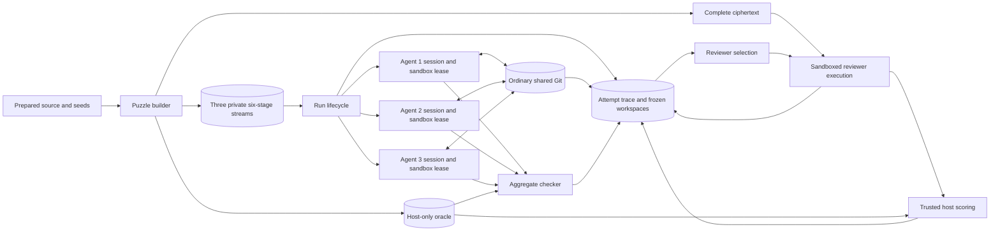

# Palimpsest Architecture

Palimpsest is a local, behavior-neutral runner for a three-agent decipherment puzzle. It builds deterministic private evidence, runs three persistent model sessions concurrently, gives them ordinary shared Git and aggregate checking, stops them only for voluntary completion or configured token and wall-time limits, and evaluates whatever they leave behind.

The architecture is intentionally small. It preserves the mechanics that define the puzzle and the operational boundaries needed to protect the host and oracle. It does not encode a collaboration protocol or harden the experiment against every workaround.

## Architectural Drivers

| Driver | Consequence |
| --- | --- |
| Agent-created behavior | The runner states the joint objective and available tools without recommending an algorithm, assigning roles, imposing rounds, or requiring artifacts. |
| Concurrent persistent work | Three independent sessions remain active across as many response and tool cycles as their token budgets and the run clock permit. |
| Different private evidence | Each agent receives one immutable six-stage stream outside the Git checkout. |
| Review of a prior rule | The first three stages use the base key; the last three share one hidden partial re-key that invalidates only a controlled subset of mappings. |
| Explicit but voluntary collaboration | Every agent is told that peers are active and that ordinary shared Git is the team channel. Git use is optional and unmetered. |
| Useful self-checking | An oracle-backed checker reports only aggregate quality for the calling agent's currently visible evidence. |
| Outcome-first evaluation | A reviewer chooses how to run the frozen team repository instead of requiring a solver manifest or canonical layout. |
| Honest observation | Raw sharing, source recognition, unconventional workflows, missed revision, and failed collaboration remain model outcomes. |
| Limited claims | Deterministic puzzle mechanics and scores do not make agent behavior reproducible or isolate general capabilities. |

## System Context


```mermaid
flowchart LR
    SOURCE["Prepared source and seeds"] --> BUILD["Puzzle builder"]
    BUILD --> ORACLE[("Host-only oracle")]
    BUILD --> STREAMS[("Three private six-stage streams")]
    BUILD --> FULL["Complete ciphertext"]

    RUN["Run lifecycle"] --> A1["Agent 1 session and sandbox lease"]
    RUN --> A2["Agent 2 session and sandbox lease"]
    RUN --> A3["Agent 3 session and sandbox lease"]
    STREAMS --> RUN

    A1 <--> GIT[("Ordinary shared Git")]
    A2 <--> GIT
    A3 <--> GIT

    A1 --> CHECK["Aggregate checker"]
    A2 --> CHECK
    A3 --> CHECK
    ORACLE --> CHECK

    RUN --> TRACE[("Attempt trace and frozen workspaces")]
    GIT --> TRACE
    CHECK --> TRACE

    TRACE --> REVIEW["Reviewer selection"]
    FULL --> EXEC["Sandboxed reviewer execution"]
    REVIEW --> EXEC
    EXEC --> SCORE["Trusted host scoring"]
    ORACLE --> SCORE
    EXEC --> TRACE
    SCORE --> TRACE
```

Python owns deterministic text preparation, cipher generation, partial re-keying, aggregate checking, overlap observation, and final scoring. TypeScript/Node owns session lifecycle, the single `ModelAdapter` contract, live provider and deterministic fixture construction, stage delivery, local tool exposure, Git setup, token and wall-time cutoffs, trace capture, reviewer-selected execution, and the operator commands.

The TypeScript runtime is one root application under `src/`; only the Docker command subsystem has a nested `src/sandbox/` ownership boundary. Python is one distribution under `python/palimpsest/`. The runtimes exchange plain recorded files and narrow subprocess results. There is no workspace package, compatibility barrel, deleted-layout alias, or stored-record migration.

## Puzzle Build

`puzzle:build` prepares one attempt from repository-held source fixtures and explicit CLI parameters.

The builder:

1. prepares and tokenizes the source text;
2. constructs a seeded word-type substitution;
3. selects a controlled mapping subset for one partial re-key;
4. creates three contiguous private streams;
5. divides every stream into six immutable stages;
6. applies the base key to stages one through three and the shared partial re-key to stages four through six;
7. verifies that every agent receives useful evidence on both sides of the transition;
8. writes the stage sources and oracle outside agent workspaces; and
9. writes the complete ciphertext used only for final evaluation.

Selected mappings differ after the transition, unselected mappings remain unchanged, and earlier stage files are never rewritten. Stage names and public configuration do not reveal the transition.

The active profile uses six global stages at two-minute intervals and a changed-token-mass target of approximately 20 percent. Stage cadence, transition geometry, token budget, model, and wall-time cutoff remain explicit operator inputs rather than hard-coded architectural constants. The build and attempt records retain the subset needed by their current contracts; they do not repeat the CLI seed, changed-token-mass target, adapter, or model as standalone fields.

## Agent Environment

Each agent receives:

- its identity and the identities of two concurrent peers;
- the concise joint-team prompt from the proposal;
- a private evidence directory containing only released stages assigned to it;
- a separate clone of the shared Git repository;
- the same target-excluded reference corpus;
- local file, shell, and code tools;
- `check_reconstruction`;
- `wait_for_activity`; and
- the same class of model adapter and resource policy.

Prepared plaintext, cipher keys, unreleased stages, peer-private evidence, checker internals, provider credentials, and host-control surfaces stay outside agent workspaces.

Private evidence is separate from the Git checkout to reduce accidental commits. This is not a content firewall: an agent may deliberately copy or encode private material into Git, and the runner records rather than rejects that choice.

### Command Sandbox

Model-authored shell commands run in attempt-scoped Linux sandbox leases rather than directly on the host. The runner creates one lease for each agent, routes every local command from that agent through the same healthy lease, and supplies one fixed, role-specific view:

- `/workspace` is the calling agent's persistent worktree and is read-write;
- `/evidence` contains only that agent's released private stages and is read-only;
- `/reference` is the target-excluded reference corpus and is read-only;
- `/git/shared.git` is the ordinary shared bare repository and is read-write; and
- `/tmp` is private lease-local storage that is discarded with the lease.

Containers receive an allowlisted non-secret environment, no public network, a read-only root, no added capabilities, no new privileges, and fixed host-safety limits. The runner executes an inspected image ID whose source label matches the checked-in sandbox definition. The image identity and effective limits are retained as operational attempt metadata; they do not make a run valid, change a score, or support an adversarial-containment claim.

The sandbox limits what host resources a command can see without prescribing what the agent does inside its declared surfaces. Lease creation and every command have absolute deadlines. A nonzero command leaves a healthy lease available; timeout, cancellation, output overflow, or resource termination abandons the lease so the command cannot continue in the background. A later command may receive a replacement lease over the same host-backed workspace, evidence, reference corpus, and Git repository.

If the sandbox runtime interrupts an in-flight command and returns before the command deadline, the runner replaces the affected lease and reports the command outcome as indeterminate without replaying it. The agent can inspect its persistent workspace and Git state before deciding how to continue. If replacement cannot complete, the session records an infrastructure error. Lease generations and recovered indeterminate commands remain visible in the attempt trace.

## Prompt Contract

The prompt states:

- the shared reconstruction objective;
- the agent's identity;
- that two peers are working concurrently with different private evidence;
- that Git is the team's shared communication channel;
- that local tools and aggregate checking are available;
- that agents choose their own roles, strategy, branches, files, and cadence; and
- a non-enforced request to share code and compact findings rather than raw ciphertext or reconstructed prose.

The prompt does not announce the partial re-key, recommend a decoding technique, prescribe a repository structure, assign work, require Git use, or request mappings, hypotheses, confidence, checkpoints, or reasoning traces.

## Session Lifecycle

`puzzle:run` creates exactly three independent persistent sessions and one shared ordinary Git remote. A session may be:

- `working`;
- `waiting`;
- `finished`;
- `token-exhausted`;
- `time-exhausted`; or
- `infrastructure-error`.

A model response may continue through tool calls, request activity waiting, or end with a final response. There is no configured limit on response count, tool calls, checker calls, Git operations, branches, commits, or collaboration cycles.

The run lifecycle enforces only:

- a cumulative model-token limit for each agent;
- one wall-time cutoff for the attempt; and
- ordinary host-safety limits needed to stop runaway local processes or protect secrets.

Token exhaustion stops only the affected session. A final response voluntarily finishes only the responding session, which is not reinvoked. The wall-time cutoff stops all sessions still active and freezes the repository and workspaces.

### Staged Activity

One monotonic clock controls stage availability. At each configured offset, the supervisor atomically adds the next immutable file to every eligible private stream. Release does not depend on a model response, tool call, checker call, Git action, or apparent progress.

Stage release and peer-visible Git changes produce activity events. An agent that chose to wait may resume when an event occurs. Working agents continue uninterrupted, and finished or exhausted agents remain stopped. Activity events do not create a round or synchronize peers.

### Git

Agents use ordinary local Git behavior: clone, fetch, pull, branch, commit, merge, rebase, inspect, and push as supported by the configured remote. The experimental runner adds no byte accounting, publication slots, required ref namespaces, content warnings, raw-text filters, or collaboration-specific rate limits.

Normal Git failures remain visible to agents. The runner does not merge, resolve conflicts, pull, retry, or repair repository state on their behalf.

## Aggregate Checker

`check_reconstruction(path)` evaluates a model-selected candidate only against plaintext corresponding to the calling agent's currently released stages.

A successful result contains:

- `matchedWords`;
- `totalWords`;
- `coverage`; and
- `accuracy`.

An unsuccessful call returns a plain execution or input error. Missing, extra, malformed, and unresolved tokens count according to the recorded scoring policy.

The checker never returns correct plaintext words, expected tokens, mismatch positions, unreleased-stage results, peer-private results, the transition stage, or changed-mapping identities. Calls are unlimited except for the token and wall-time consumed by the session.

## Freeze and Evaluation

The attempt freezes when all sessions have terminated or the wall-time cutoff occurs. Freeze captures the shared repository, each workspace, the stage state, session termination reasons, and the normalized observation stream. It does not require clean worktrees, a final commit, a particular branch, or a private submission.

After freeze, the runner completely writes a same-directory temporary summary and atomically renames it to `attempt.json`. Only then does optional overlap observation begin. An overlap failure remains an infrastructure failure and emits no success object or fabricated `overlap.json`, but it does not remove or invalidate the summary, trace, frozen Git, or frozen workspaces; later evaluation reads the strict current-version attempt without rerunning agents.

`puzzle:evaluate` asks a reviewer to inspect the frozen team work and record:

- one selected frozen agent workspace;
- an execution command;
- the expected output path; and
- optional review notes.

The selected command runs in a separate short-lived container. It receives a writable copy of the selected frozen workspace at `/workspace`, the complete ciphertext read-only at `/input/ciphertext.txt`, frozen Git read-only at `/git/shared.git`, and disposable `/tmp`. It does not receive prepared plaintext, cipher keys, checker access, provider credentials, peer evidence, undeclared host files, or public network access. This standard boundary protects the oracle and host; it is not an adversarial solver-validation program.

Evaluation produces:

- `scored` when reconstruction output exists;
- `not-runnable` when no credible execution path can be selected;
- `no-output` when execution completes without reconstruction output; or
- `execution-error` when the selected command fails or times out.

When output exists, a trusted host-side scorer compares normalized word tokens positionally against the prepared plaintext. The untrusted evaluation container never receives the oracle. Missing, extra, and unresolved tokens count as incorrect. The report contains matched words, total words, coverage, and accuracy.

## Observation

The attempt trace records:

- the attempt ID plus token, wall-time, stage-interval, agent-count, and stage-count configuration;
- stage release events;
- session state and cumulative token use;
- normalized model-turn summaries, final response text, and full tool arguments and results;
- checker requests and aggregate results;
- observed Git head changes and repository history;
- termination and freeze;
- reviewer selection and notes;
- evaluation execution and score; and
- narrow raw-overlap findings.

`trace.meta.json` records one immutable wall-clock origin before the first event. Live, overlap, and evaluation producers all write through the same resumable observation log and recursive redaction path. Reopening validates the complete existing log before appending; sequence numbers increase by exactly one and elapsed times never decrease, including when later processes append post-run work. Malformed, nonsequential, or time-regressing traces fail explicitly rather than being repaired.

This chronology lets a reviewer compare the hidden transition's evidence arrival with continued use of an older rule, peer communication, and later code or note changes. It does not require a canonical belief artifact and does not claim access to private chain of thought.

The overlap observer searches only for obvious exact or normalized long spans shared between committed blobs and private evidence. It retains every unique logical-path/blob pair reachable from current Git refs, including content committed and later deleted, while materializing each unique text blob only once. Findings record both `committedPath` and `committedBlobId`, so identical content at different paths and historical content at one path remain distinguishable. A separate traversal counts repeated blob references across reachable commit trees; binary and invalid UTF-8 blobs are skipped and counted. Reflog-only and unreachable objects are outside the observation. The observer runs after the attempt and never blocks Git, changes a score, invalidates a run, or expands into adversarial encoding detection.

## Failure Semantics

| Condition | Classification |
| --- | --- |
| Wrong reconstruction, no output, broken code, early finish, stale belief, no Git use, merge conflict, raw sharing, source recognition, checker exploitation, or unconventional workflow | Model outcome |
| Individual token exhaustion or global wall-time cutoff | Configured termination |
| Model provider unavailable, declared stage not delivered, shared Git unavailable, checker unavailable, sandbox inspection, launch, or cleanup failure, malformed trace, cutoff not enforced, freeze failure, or scorer unable to evaluate valid output | Infrastructure failure |
| Reviewer cannot infer how to run the repository | `not-runnable` evaluation outcome |

Infrastructure failures are reported separately. They do not cause the runner to repair or reinterpret model work.

## Operator Interface

The canonical live workflow uses explicit build and attempt roots plus recorded run limits:

```bash
pnpm puzzle:sandbox:build
pnpm puzzle:build -- --output artifacts/build-17 --seed 17
pnpm puzzle:run -- \
  --build artifacts/build-17 \
  --output artifacts/attempt-17 \
  --adapter openai \
  --model "<model>" \
  --token-budget 200000 \
  --wall-time-ms 3600000
pnpm puzzle:evaluate -- --attempt artifacts/attempt-17
```

`pnpm puzzle:offline` composes the same build, run, freeze, and evaluate path with deterministic fixture agents and no external model call.

## Verification

Verification is proportional to the active claims:

- Repository-boundary tests derive active tracked and nonignored paths from Git, so ignored caches, empty legacy directories, and preserved historical evidence cannot change the result.
- Python unit and property tests cover six-stage geometry, shared partial re-key invariants, immutable earlier evidence, checker non-disclosure, unequal-length scoring, and overlap observation.
- TypeScript tests cover prompt neutrality, exactly three independent sessions, voluntary completion, waiting and wake behavior, ordinary unmetered Git, token and wall-time cutoffs, sandbox mounts and path containment, resumable trace chronology, reachable Git history, freeze, reviewer selection, and evaluation statuses.
- Docker-backed fixtures prove declared workspace and Git access while host, peer, oracle, credential, and public-network probes fail; prove that ordinary commands reuse one agent lease; and prove that timeout, cancellation, output overflow, lease close, and grading remove their owned containers.
- Path-containment tests prove absolute, parent-relative, missing, non-regular, and symbolic-link escape outputs fail explicitly.
- Evaluator tests cover reviewer selection ordering, `scored`, `not-runnable`, `no-output`, and `execution-error`; session and Git tests cover voluntary completion, waiting, cutoffs, ordinary branches, and peer-visible ref changes.
- One fresh offline build-run-evaluate smoke test proves the active path without an external model call.

The canonical acceptance commands are `pnpm verify`, `git diff --check`, and a fresh `pnpm puzzle:offline` run following `specs/009-refactor-puzzle-architecture/quickstart.md`. Pull requests and merge-queue candidates reproduce the pinned environment, build the sandbox, and run the same verification as the required `verify` status check.

Palimpsest does not require channel-capacity proofs, fixed publication replay, hostile-solver red teams, exact model replay, or a particular empirical agent outcome before the puzzle may be run.

## Claim Boundary

For fixed recorded scientific inputs, puzzle generation, stage bytes, partial re-key selection, checker aggregates, fixture behavior, overlap observations, and final scoring are deterministic. Live model choices, operating-system scheduling, Git interleaving, reviewer judgment, and collaboration outcomes are not.

The architecture supports observing one compound puzzle. It does not establish a secure multi-tenant service, prevent covert communication, prove source non-recognition, isolate a causal communication effect, or certify general reasoning, collaboration, or belief-revision ability.
