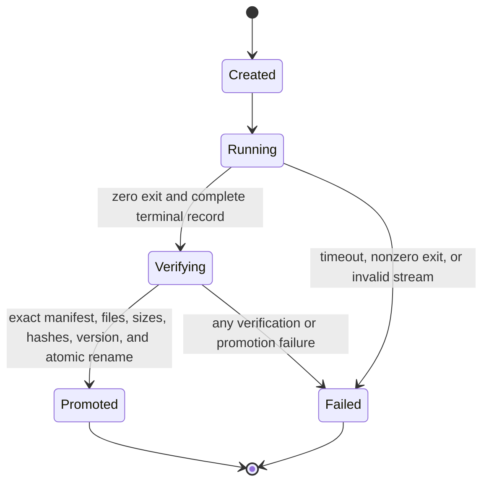

# Data Model: Foundation and Evidence Protocol

## Contract Definition

The contract definition is an immutable JSON Schema Draft 2020-12 document identified by a stable `$id` and an integer schema version. Every object contract requires `schemaVersion`, declares its complete field set, and forbids undeclared fields. A contract change either creates a new version or provides an explicit migration outside Milestone 1.

Relationships:

- A fixture references exactly one contract definition and expected schema version.
- A production request and response manifest validate against contract definitions.
- A gate report validates against the gate-report contract.

## Fixture

| Field | Type | Rules |
| --- | --- | --- |
| `fixtureId` | string | Stable ASCII identifier unique in the fixture manifest |
| `contractId` | string | Must resolve to one schema in the registry |
| `schemaVersion` | integer | Must equal a supported version |
| `inputPath` | relative path | Canonical safe path under the fixture root |
| `expectedVerdict` | enum | `accept` or `reject` |
| `expectedReason` | reason code or null | Required for rejection and absent for acceptance |
| `expectedPointer` | JSON Pointer or null | Identifies the offending field for rejection |
| `canonicalPath` | relative path or null | Required for accepted canonical-byte fixtures |
| `sha256` | lowercase hex or null | Required for accepted canonical-byte fixtures |

## Canonical Archive Entry

| Field | Type | Rules |
| --- | --- | --- |
| `path` | string | Relative NFC POSIX path, no empty or dot segments, no backslash, no collision, within the predeclared ustar field limit |
| `kind` | enum | `file` or `directory` |
| `content` | bytes | Present only for files |
| `mode` | derived integer | Fixed normalized mode by entry kind; caller metadata is ignored |

Entries are sorted by canonical path bytes. Directories end in `/`. The archive ends with exactly two zero blocks. The archive digest is SHA-256 over the complete canonical ustar byte stream.

## Production Request

| Field | Type | Rules |
| --- | --- | --- |
| `schemaVersion` | integer | Exact supported request version |
| `requestId` | string | Stable identifier |
| `producer` | object | Command identity and exact allowed producer versions |
| `immutableInputs` | array | Sorted digest-addressed references |
| `deadlineMs` | integer | Positive bounded duration declared before launch |
| `outputPolicy` | object | Entry count, byte, path, and archive limits |
| `requestDigest` | lowercase hex | SHA-256 over canonical request bytes excluding this derived field |

The request is frozen before the attempt and reused unchanged for every retry.

## Progress Record

| Field              | Type           | Rules                                                  |
| ------------------ | -------------- | ------------------------------------------------------ |
| `schemaVersion`    | integer        | Exact supported progress version                       |
| `sequence`         | integer        | Starts at zero and increases by one                    |
| `kind`             | enum           | `started`, `progress`, `completed`, or `failed`        |
| `requestDigest`    | lowercase hex  | Must match the frozen request                          |
| `responseManifest` | object or null | Present only on the single terminal `completed` record |

The NDJSON stream contains one canonical JSON object plus LF per record. Exactly one terminal record is required and no records may follow it.

## Artifact Response Manifest

| Field | Type | Rules |
| --- | --- | --- |
| `schemaVersion` | integer | Exact supported manifest version |
| `requestDigest` | lowercase hex | Binds the immutable request |
| `producer` | object | Exact producer name and version |
| `environment` | object | Exact runtime, package manager, Git, platform, and implementation revision |
| `inputs` | array | Exact immutable input references |
| `outputs` | array | Sorted unique relative paths with byte length and SHA-256 |
| `archive` | object | Canonical archive byte length and SHA-256 |

The manifest is accepted only if its output set exactly equals the staged filesystem set and all recorded sizes and digests match.

## Production Attempt

| Field | Type | Rules |
| --- | --- | --- |
| `attemptId` | string | Unique local identifier |
| `requestDigest` | lowercase hex | Same for retries of one request |
| `startedAt` | timestamp | Operational metadata, excluded from deterministic artifact bytes |
| `status` | enum | `created`, `running`, `verifying`, `promoted`, or `failed` |
| `failure` | object or null | Normalized failure class and detail, required for `failed` |
| `artifactDigest` | lowercase hex or null | Required only for `promoted` |

State transitions:

A retry creates a new attempt in `created` with the same request digest and a new empty staging directory. No transition leaves `failed` or `promoted`.

## Promoted Artifact

A promoted artifact is an immutable directory addressed by the canonical archive SHA-256. It contains the exact declared outputs, canonical response manifest, and canonical archive. Its identity does not include attempt timestamps or mutable storage paths.

## Failed Attempt Record

The failed attempt record contains the request digest, attempt ID, normalized failure class, failing condition, producer exit information if available, and diagnostics safe for maintainers. It is append-only and cannot appear under the promoted artifact namespace.

Failure classes for Milestone 1 are `deadline_exceeded`, `producer_exit`, `malformed_progress`, `truncated_progress`, `missing_output`, `undeclared_output`, `digest_mismatch`, `length_mismatch`, `producer_version`, `unsafe_output`, `promotion_io`, and `unsupported_environment`.

## Gate Report

| Field | Type | Rules |
| --- | --- | --- |
| `schemaVersion` | integer | Exact supported report version |
| `gateId` | string | Milestone or gate identifier |
| `state` | enum | `predeclared` or `completed` |
| `question` | string | Frozen before the judged run |
| `frozenInputs` | array | Sorted digest-addressed references |
| `thresholds` | array | Named, typed comparison rules |
| `criteria` | object | Explicit pass, rework, and stop meanings |
| `predeclarationDigest` | lowercase hex | Digest over the frozen pre-run projection |
| `environment` | object or null | Required only when completed |
| `producerVersions` | array or null | Required only when completed |
| `rawArtifacts` | array or null | Digest-addressed references required only when completed |
| `analysis` | object or null | Required only when completed |
| `result` | enum or null | `pass`, `rework`, or `stop`; required only when completed |
| `followUp` | string or null | Required only when completed |

Completion recomputes the pre-run projection and requires it to match `predeclarationDigest`. This makes changes to the question, frozen inputs, thresholds, or criteria detectable.
