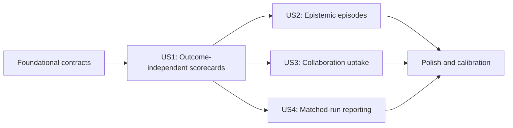

# Tasks: Epistemic Process Grader

**Input**: Design documents from `specs/022-epistemic-process-grader/`  
**Prerequisites**: `plan.md`, `spec.md`, `research.md`, `data-model.md`, `contracts/`, `quickstart.md`

**Verification**: Tests are mandatory for this feature because the specification makes deterministic metrics, evidence-resolvable citations, outcome blinding, reviewer independence, legacy compatibility, and workflow neutrality part of the scientific contract. All verification remains provider-free unless an operator separately authorizes a qualitative review.

**Organization**: Tasks are grouped by user story so each research capability can be implemented and tested as an explicit increment.

## Format: `[ID] [P?] [Story] Description`

- **[P]**: Can run in parallel with adjacent tasks because it uses different files and has no dependency on their unfinished changes.
- **[Story]**: Maps the task to a prioritized user story in `spec.md`.
- Every task names the file or files it changes.

## Phase 1: Setup (Shared Infrastructure)

**Purpose**: Establish the feature's local module, configuration, and fixture layout without adding new runtime dependencies.

- [x] T001 Document grading configuration ownership and synthetic fixture conventions in `grading/README.md` and `tests/fixtures/grading/README.md`
- [x] T002 Add `puzzle:grade`, `puzzle:review`, and `puzzle:report` script entries that route through the existing CLI in `package.json`
- [x] T003 [P] Add the minimal strict two-reviewer configuration described by the CLI contract in `grading/epistemic-process-v1.yaml`
- [x] T004 [P] Add reusable completed, interrupted, shared, and isolated run-artifact builders without provider or Docker dependencies in `tests/support/grading-fixture.ts`

---

## Phase 2: Foundational (Blocking Prerequisites)

**Purpose**: Define the strict evidence, analysis, rubric, and publication boundaries required by every user story.

**CRITICAL**: No user-story implementation begins until these contracts and compatibility checks pass.

### Verification

- [x] T005 [P] Add strict decoder tests for evidence references, observability states, measures, dimension reviews, judge reviews, and unknown-field rejection in `src/grading/contracts.test.ts`
- [x] T006 [P] Add backward-compatibility and atomic-append tests for `overlap`, `performance`, and `process-review` analysis variants in `src/run/record.test.ts`
- [x] T007 [P] Add Python request/response contract tests for finite measures, denominators, missingness, and canonical JSON output in `python/tests/evaluation/test_process.py`
- [x] T008 [P] Add trace compatibility tests for optional Git ref targets and unchanged schema-v1 historical events in `src/trace.test.ts`

### Implementation

- [x] T009 Implement exact decoders and TypeScript types for `EvidenceReference`, `EvidenceItem`, `EvidenceBundle`, `QuantitativeMeasure`, `EpistemicEpisode`, `DimensionReview`, `JudgeReview`, `RunScorecard`, and `BehaviorReport` in `src/grading/contracts.ts`
- [x] T010 Extend the strict `RunAnalysis` union, contained detail paths, digests, reviewer statuses, and legacy decoding in `src/run/record.ts`
- [x] T011 Implement the versioned epistemic, social, and instrumental dimensions with dimension-specific 0-4 anchors and explicit unobservable/not-applicable states in `src/grading/rubric.ts`
- [x] T012 Implement strict Python decoding and canonical serialization for deterministic process-measure requests and responses in `python/palimpsest/evaluation/process.py`

**Checkpoint**: Strict grading contracts decode, legacy run records remain valid, and no grading code can mutate frozen evidence.

---

## Phase 3: User Story 1 - Grade Process Independently of Outcome (Priority: P1) - MVP

**Goal**: Produce one non-composite run scorecard with deterministic outcome/activity measures and two outcome-blind, evidence-linked qualitative reviews.

**Independent Test**: Grade a lucky successful fixture and a strong-process unsuccessful fixture. Confirm that outcome and process ratings can diverge, unavailable dimensions remain missing, both judge views remain separate, and neither judge bundle contains model identity or final outcome.

### Verification for User Story 1

- [x] T013 [P] [US1] Add lucky-success, strong-process-failure, missing-observation, and interrupted-attempt contrast artifacts in `tests/fixtures/grading/outcome-process-contrasts.json`
- [x] T014 [P] [US1] Add evidence-index tests for chronological ordering, stable references, explicit omissions, provider/model redaction, oracle exclusion, and final-outcome exclusion in `src/grading/evidence.test.ts`
- [x] T015 [P] [US1] Add deterministic metric tests for outcome, activity, usage, tool mix, publication, denominators, and unavailable-versus-zero behavior in `python/tests/evaluation/test_process.py`
- [x] T016 [P] [US1] Add review tests with two fake provider families covering independent packet ratings, invalid citations, rich provider failures, incomplete status, no averaging, and outcome-blind invariance in `src/grading/review.test.ts`
- [x] T017 [P] [US1] Add grading detail-publication tests for safe paths, content digests, immutable files, duplicate analysis identity, cleanup after failed record append, and unchanged trace/evaluations in `src/grading/grade.test.ts`
- [x] T018 [P] [US1] Extend CLI contract tests for provider-free `grade`, explicitly authorized `review` and `--resume`, stderr-only failures, and rejection before provider construction in `tests/puzzle/cli.test.ts`

### Implementation for User Story 1

- [x] T019 [US1] Implement strict run/trace/topology validation, complete evidence indexing and reviewer-safe redaction in `src/grading/evidence.ts`, plus deterministic ledger routing/projection, bounded packet compilation, and omission manifests in `src/grading/packets.ts`
- [x] T020 [US1] Implement mechanical outcome, elapsed-time, stage-latency, tool, checker, message/read, Git-activity, token, termination, and publication measures in `python/palimpsest/evaluation/process.py`
- [x] T021 [US1] Implement provider-free grading orchestration, Python invocation, atomic detail-directory publication, duplicate detection, and `performance` analysis append in `src/grading/grade.ts`
- [x] T022 [US1] Implement strict grading-config loading, distinct-provider validation, per-reviewer token limits, packet-size/schema/leakage preflight, and literal spend authorization before provider creation in `src/grading/review.ts`
- [x] T023 [US1] Implement two independent reviewer packet sequences, content-addressed success/failure checkpointing, output/citation validation, rich provider diagnostics, explicit incomplete states, and no automatic retry or consensus in `src/grading/review.ts`
- [x] T024 [US1] Freeze process judgments before joining canonical-origin evaluations and publish separate outcome, epistemic, social, and instrumental scorecard sections in `src/grading/review.ts`
- [x] T025 [US1] Route `grade` and `review` flags, success JSON, and non-zero diagnostics through `src/cli.ts`
- [x] T026 [US1] Export the completed grading and review surfaces through `src/grading/index.ts`

**Checkpoint**: User Story 1 independently distinguishes result quality from observable process quality and can be demonstrated entirely with fake reviewers.

---

## Phase 4: User Story 2 - Reconstruct Epistemic Episodes (Priority: P2)

**Goal**: Reconstruct evidence-linked commitments, tests, revisions, and downstream consequences without claiming access to hidden model state.

**Independent Test**: Review a trace with a false commitment, contrary evidence, changed behavior, and later reuse. Confirm that the episode cites every observed stage, distinguishes asserted-only from behavioral revision, records missed opportunities, and retains competing judge interpretations.

### Verification for User Story 2

- [x] T027 [P] [US2] Add supported-revision, asserted-only, missed-revision, unchanged, ambiguous, and post-hoc narration traces in `tests/fixtures/grading/epistemic-episodes.json`
- [x] T028 [P] [US2] Add episode schema and citation tests for optional stages, counterevidence, observability, confidence, and hidden-state language rejection in `src/grading/contracts.test.ts`
- [x] T029 [P] [US2] Add packet-review tests for epistemic episode reconstruction, deterministic review assembly, contradictory interpretations, identity consistency, and preserved disagreement in `src/grading/review.test.ts`
- [x] T030 [P] [US2] Add frozen review-coded metric tests for revision opportunities, supported revisions, and denominator provenance in `python/tests/evaluation/test_process.py`

### Implementation for User Story 2

- [x] T031 [US2] Extend deterministic evidence routing with packet-local citation indexes, complete coverage metadata, source references, projection versions, and the 256 KiB bound in `src/grading/packets.ts`
- [x] T032 [US2] Add observable-language instructions and anchored episode status definitions to the versioned review rubric in `src/grading/rubric.ts`
- [x] T033 [US2] Implement one strict response per applicable ledger packet followed by citation-preserving deterministic `ReviewerOutput` assembly without a model integration call in `src/grading/review.ts`
- [x] T034 [US2] Validate episode stage references, counterevidence, asserted-versus-behavioral revision, and prohibited hidden-state claims in `src/grading/contracts.ts`
- [x] T035 [US2] Compute deterministic summaries from frozen reviewer-coded revision opportunities while preserving each judge as a separate basis in `python/palimpsest/evaluation/process.py`
- [x] T036 [US2] Add completed episode and disagreement sections to immutable scorecard details in `src/grading/review.ts`

**Checkpoint**: User Story 2 independently exposes epistemic transitions and missed revisions as auditable episode evidence rather than global impressions.

---

## Phase 5: User Story 3 - Evaluate Collaboration as Causal Contribution (Priority: P3)

**Goal**: Distinguish contribution, transmission, uptake, integration, verification, duplication, and repair from raw communication volume.

**Independent Test**: Grade a shared trace containing adopted work, ignored useful work, duplicated work, and repaired conflict, plus an isolated trace. Confirm that uptake is linked across agents and into later action or the canonical artifact, while isolated social dimensions are not applicable rather than zero.

### Verification for User Story 3

- [x] T037 [P] [US3] Add adopted, ignored, independently rediscovered, duplicated, repaired-conflict, ambiguous-authorship, and isolated-condition fixtures in `tests/fixtures/grading/collaboration-contrasts.json`
- [x] T038 [P] [US3] Add runtime and Git callback tests proving future `git.changed` events retain changed ref object IDs without adding feedback or requiring model Git behavior in `src/run/runtime.test.ts` and `src/git.test.ts`
- [x] T039 [P] [US3] Add collaboration-review tests for cross-agent contribution-to-uptake links, activity-without-uptake, canonical integration, and isolated not-applicable ratings in `src/grading/review.test.ts`
- [x] T040 [P] [US3] Add mechanical and review-coded collaboration metric tests with explicit opportunity denominators and historical ref-target missingness in `python/tests/evaluation/test_process.py`
- [x] T041 [P] [US3] Add prompt and tool-surface regression assertions that grading introduces no roles, turns, checkpoints, reports, merges, or coordination sequence in `src/run/prompt.test.ts` and `src/run/tools.test.ts`

### Implementation for User Story 3

- [x] T042 [US3] Resolve changed published refs to object IDs in the existing Git callback without changing command results or metering in `src/git.ts`
- [x] T043 [US3] Persist optional ref targets in future Git activity and trace observations while retaining historical event compatibility in `src/run/runtime.ts`
- [x] T044 [US3] Add communication reads/messages, Git states, authorship evidence, and canonical artifact consequences to reviewer-safe evidence normalization in `src/grading/evidence.ts`
- [x] T045 [US3] Add anchored social review instructions for novelty, transmission, uptake, integration, independent verification, duplication, and repair in `src/grading/rubric.ts`
- [x] T046 [US3] Route cross-agent contribution, uptake, actor/action, and Git-consequence evidence into the social packet while deterministically skipping social calls for isolated origins in `src/grading/review.ts`
- [x] T047 [US3] Compute collaboration opportunity, uptake, integration-latency, participation-balance, and missing-trajectory measures without treating activity counts as quality in `python/palimpsest/evaluation/process.py`

**Checkpoint**: User Story 3 independently distinguishes useful collaboration from communication volume and does not penalize conditions where collaboration is unavailable.

---

## Phase 6: User Story 4 - Compare Model Behavior Across Runs (Priority: P4)

**Goal**: Produce design-aware cross-run reports with dimension distributions, uncertainty, missingness, disagreement, and bounded process-outcome relationships.

**Independent Test**: Aggregate a matched multi-run fixture and an intentionally mismatched fixture. Confirm that the first reports per-dimension distributions and clustered uncertainty, while the second cannot be labeled a matched contrast and neither emits a composite ranking.

### Verification for User Story 4

- [x] T048 [P] [US4] Add descriptive, valid matched-contrast, mismatched-input, mixed-version, clustered-origin, incomplete-review, and single-run report fixtures in `tests/fixtures/grading/report-cases.json`
- [x] T049 [P] [US4] Add strict report-config and behavior-report decoder tests for inclusion, matching fields, treatment, experimental unit, exclusions, claim type, and no composite field in `src/grading/contracts.test.ts`
- [x] T050 [P] [US4] Add deterministic aggregation tests for per-dimension distributions, missingness, uncertainty, reviewer agreement, run clustering, and process-outcome associations in `python/tests/evaluation/test_process.py`
- [x] T051 [P] [US4] Add report service tests for contained discovery, analysis-version compatibility, explicit exclusion reasons, unmatched contrast rejection, and byte-stable source runs in `src/grading/report.test.ts`
- [x] T052 [P] [US4] Extend CLI contract tests for provider-free `report`, strict output containment, and non-zero unsupported-claim failures in `tests/puzzle/cli.test.ts`

### Implementation for User Story 4

- [x] T053 [US4] Extend grading contracts with strict report configuration, matching declarations, experimental-unit rules, and non-composite behavior-report output in `src/grading/contracts.ts`
- [x] T054 [US4] Implement deterministic per-dimension aggregation, missingness, uncertainty, reviewer-agreement, clustered-origin, and process-outcome calculations in `python/palimpsest/evaluation/process.py`
- [x] T055 [US4] Implement contained run discovery, eligibility/version checks, declared matching, treatment isolation, descriptive fallbacks, and atomic report publication in `src/grading/report.ts`
- [x] T056 [US4] Route `report` flags, JSON success output, and unsupported-claim diagnostics through `src/cli.ts`
- [x] T057 [US4] Export reporting surfaces through `src/grading/index.ts`

**Checkpoint**: User Story 4 independently compares eligible runs without pseudo-replication, hidden exclusions, composite rankings, or unsupported causal language.

---

## Phase 7: Polish & Cross-Cutting Concerns

**Purpose**: Validate the full research boundary, documentation, performance, and provider-free operability.

- [x] T058 [P] Document the grading object, rubric interpretation, calibration protocol, censored attempts, and claim limits in `docs/grading.md`
- [x] T059 [P] Reconcile the new post-run analysis and neutral Git observation with the authoritative design in `docs/proposal.md`, `docs/architecture.md`, and `docs/roadmap.md`
- [x] T060 [P] Add a frozen synthetic calibration manifest and human citation-audit worksheet without model or outcome identity in `grading/calibration/manifest.json` and `grading/calibration/audit.md`
- [x] T061 Add a multi-thousand-event provider-free grading fixture and assert linear bounded processing in `src/grading/grade.test.ts`, plus complete routing/omission accounting and bounded packets in `src/grading/packets.test.ts`
- [x] T062 Run the provider-free quickstart against synthetic artifacts and correct command or contract drift in `specs/022-epistemic-process-grader/quickstart.md`
- [x] T063 Run `pnpm verify` and the focused grading CLI/pytest suites, resolving failures only in feature-touched files listed by `specs/022-epistemic-process-grader/plan.md`
- [x] T064 Inspect prompt, tools, trace, run-record, and report outputs against all specification success criteria and record completed evidence in `specs/022-epistemic-process-grader/checklists/requirements.md`
- [x] T065 Validate the exact grading configuration, completed run artifacts, leakage scan, provider-free grade path, and reviewer token limits before any separately authorized findings-bearing review described in `grading/epistemic-process-v1.yaml`

---

## Phase 8: Resumable Ledger-Packet Review Migration

**Purpose**: Replace the failure-prone window extraction and integration protocol without changing the scientific scorecard contract.

- [x] T066 Add strict protocol-v4 `ReviewPacket`, compact ordered-array `PacketReviewerOutput`, deterministic decoding to the unchanged public dimension contract, packet-call artifact, artifact-key, resume-lineage, and rich provider-result contracts with legacy analysis decoding in `src/grading/packets.ts`, `src/grading/review.ts`, `src/run/record.ts`, and `src/model/contracts.ts`
- [x] T067 [P] Add deterministic routing/projection tests for byte stability, outcome/identity blinding, origin isolation, cross-ledger duplication, complete omission accounting, compact citation-token syntax and post-parse membership, and the 256 KiB packet limit in `src/grading/packets.test.ts` and `src/grading/review.test.ts`
- [x] T068 [P] Add provider adapter tests for finish reason, raw finish reason, response ID, actual identity, usage availability, returned text, structured-parse status, and typed transport failures in `src/model/*.test.ts`
- [x] T069 Add review orchestration tests proving six shared-origin calls, four isolated-origin calls, ordered shared-schema dimensions, required empty non-epistemic episodes, reviewer concurrency, immediate checkpoints, deterministic stage normalization and unsupported-revision episode omission with raw-response preservation and labeled cautions, identity consistency, and no integration/adjudication call in `src/grading/review.test.ts`
- [x] T070 Add explicit-resume tests proving immutable predecessors, exact v4 protocol/prompt/output-schema validation, reuse of completed packets only, predecessor usage accounting, missing-only calls, new spend authorization, no auto-discovery/retry, and window/v1-v3 non-resumability in `src/grading/review.test.ts` and `tests/puzzle/cli.test.ts`
- [x] T071 Reconcile Feature 022 plan, research, data model, CLI/data contracts, quickstart, and task evidence with protocol-v4 request-bound identities, compact ordered dimensions, assessment decoding, episode semantic repair, and no live-provider validation claim in `specs/022-epistemic-process-grader/`

---

## Dependencies & Execution Order

### Phase Dependencies

- **Phase 1 - Setup**: Starts immediately.
- **Phase 2 - Foundational**: Depends on Phase 1 and blocks every user story.
- **Phase 3 - User Story 1**: Depends on Phase 2 and is the MVP.
- **Phase 4 - User Story 2**: Depends on the User Story 1 evidence and review pipeline; its fixtures and tests can be prepared after Phase 2.
- **Phase 5 - User Story 3**: Depends on the User Story 1 evidence and review pipeline; future Git-observation work can begin after Phase 2.
- **Phase 6 - User Story 4**: Depends on completed scorecards from User Story 1; its fixtures and report contracts can be prepared after Phase 2.
- **Phase 7 - Polish**: Depends on whichever user-story increments are selected for delivery; T065 remains a precondition for paid or findings-bearing use, not authorization to spend.
- **Phase 8 - Ledger-Packet Migration**: Depends on the existing scorecard and rubric contracts. T066-T068 establish the packet and provider boundaries; T069-T070 integrate and verify orchestration and resume; T071 reconciles the documented contract. No task authorizes or claims a live provider run.

### User Story Dependency Graph



### Within Each User Story

1. Add the named contrast fixtures and verification first; confirm new tests fail for the missing behavior.
2. Implement strict models and services behind the existing local-file and subprocess boundaries.
3. Wire the CLI or scorecard surface only after lower-level contracts pass.
4. Run the independent story test before beginning the next dependent increment.

## Parallel Opportunities

- **Setup**: T003 and T004 can proceed together after T001; T002 is isolated to `package.json`.
- **Foundational**: T005-T008 can be authored in parallel, then T009-T012 can be implemented across distinct TypeScript, run-record, rubric, and Python files with coordination at their contract boundary.
- **User Story 1**: T013-T018 can be authored in parallel. After T019 defines evidence output, T020 and review configuration work in T022 can proceed alongside one another; T021 and T023-T024 then integrate them.
- **User Story 2**: T027-T030 can proceed in parallel. T031 and T032 can proceed together before T033-T036 integrate episode reviews.
- **User Story 3**: T037-T041 can proceed in parallel. T042-T043 form one ordered runtime lane while T044-T045 can proceed together; T046-T047 integrate the resulting evidence.
- **User Story 4**: T048-T052 can proceed in parallel. T053 and T054 can proceed together before T055-T057 integrate reporting.
- **Polish**: T058-T060 can proceed in parallel; validation tasks T061-T065 follow the implemented scope.
- **Ledger-Packet Migration**: T067 and T068 can proceed after T066 in parallel; T069 and T070 share orchestration and CLI surfaces and must be coordinated before T071.

## Parallel Examples

### User Story 1

```text
Run together: T013 contrast fixtures, T014 evidence tests, T015 metric tests,
T016 review tests, T017 publication tests, and T018 CLI tests.
```

### User Story 2

```text
Run together: T027 episode fixtures, T028 schema tests, T029 reviewer tests,
and T030 review-coded metric tests.
```

### User Story 3

```text
Run together: T037 collaboration fixtures, T038 Git observation tests,
T039 review tests, T040 metric tests, and T041 workflow-neutrality tests.
```

### User Story 4

```text
Run together: T048 report fixtures, T049 contract tests, T050 aggregation tests,
T051 report service tests, and T052 CLI tests.
```

## Implementation Strategy

### MVP First: User Story 1

1. Complete Setup and Foundational phases.
2. Complete T013-T026 for provider-free metrics, blinded independent review, and the non-composite scorecard.
3. Validate the lucky-success and strong-process-failure contrasts with fake reviewers.
4. Stop before any real provider review; the MVP is mechanically demonstrable without credentials or spend.

### Incremental Delivery

1. **US1** establishes the trustworthy evidence, metric, review, and publication boundary.
2. **US2** deepens qualitative interpretation into auditable epistemic episodes.
3. **US3** adds causal-process evidence for cross-agent contribution, uptake, and integration.
4. **US4** aggregates repeated matched observations without turning the grader into a leaderboard.
5. Each increment retains prior analyses, exposes missingness, and remains independently testable.

## Notes

- `[P]` marks file-independent work, not permission to bypass listed dependencies.
- Shared runs remain one team result; isolated runs retain every canonical origin without selecting a best result.
- Review-coded quantities identify their frozen judge basis and never masquerade as deterministic ground truth.
- No task adds agent roles, turns, checkpoints, reports, consensus, prescribed Git operations, automatic retries, or repair.
- T065 is a validation gate only. Paid review still requires a separate operator command with literal `--allow-spend true`.
